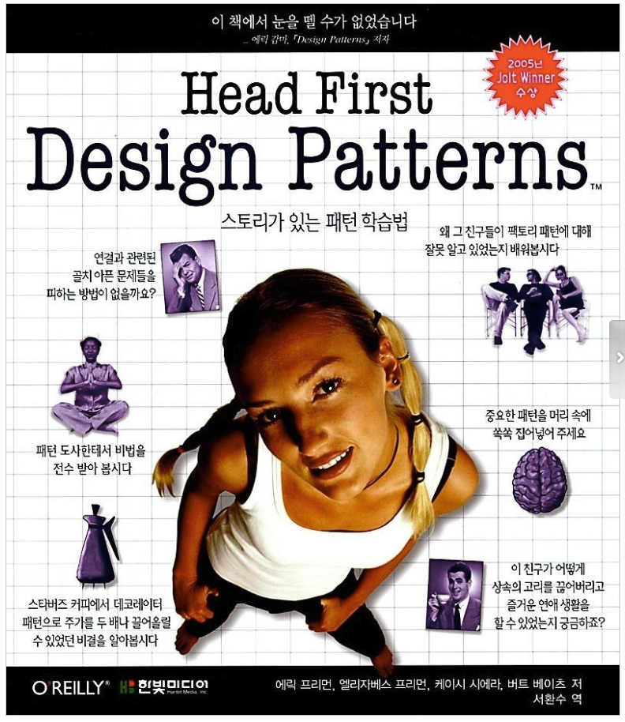

# Head First Design Patterns

헤드 퍼스트 디자인 패턴 책을 읽고 정리한 내용을 Github에 md 파일로 작성한다.

1. Strategy Patterns : https://github.com/onlydev7777/TIL/blob/main/design-patterns/strategy-patterns.md
2. Observer Patterns : https://github.com/onlydev7777/TIL/blob/main/design-patterns/observer-patterns.md
3. Decorator Patterns : https://github.com/onlydev7777/TIL/blob/main/design-patterns/decorator-patterns.md
4. Factory Patterns : https://github.com/onlydev7777/TIL/blob/main/design-patterns/factory-patterns.md 
5. Singleton Patterns : https://github.com/onlydev7777/TIL/blob/main/design-patterns/singleton-patterns.md
6. Command Patterns : https://github.com/onlydev7777/TIL/blob/main/design-patterns/command-patterns.md
7. Adapter Patterns : https://github.com/onlydev7777/TIL/blob/main/design-patterns/adapter-patterns.md
8. Facade Patterns : https://github.com/onlydev7777/TIL/blob/main/design-patterns/facade-patterns.md
9. Template Method Patterns : https://github.com/onlydev7777/TIL/blob/main/design-patterns/template-method-patterns.md
10. Iterator Patterns : https://github.com/onlydev7777/TIL/blob/main/design-patterns/iterator-patterns.md
11. Composite Patterns : https://github.com/onlydev7777/TIL/blob/main/design-patterns/composite-patterns.md