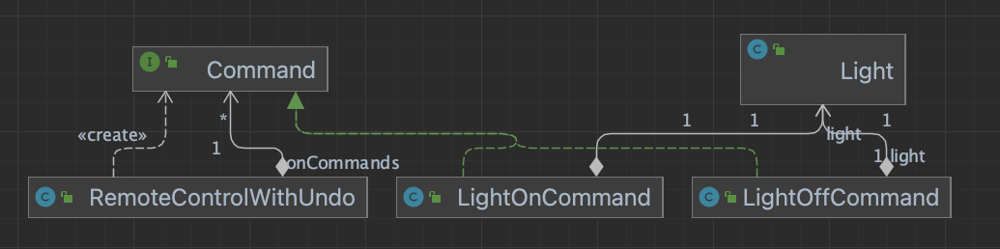

# Command-Patterns

## 커맨드 패턴 정의

커맨드 패턴을 이용하면 요구사항을 객체로 캡슐화 할 수 있으며, 매개변수를 써서 여러 가지 다른 요구 사항을 집어 넣을 수도 있습니다.   
또한 요청내역을 큐에 저장하거나 로그로 기록할 수 도 있으며 작업취소 기능도 지원 가능합니다.

## 커맨드 패턴에서 사용되는 추상적인 Roll

#### Client

- 커맨드 객체 생성
- 인보커 객체 setCommand() 호출
- 리시버 객체 설정
- RemoteLoader, RemotePartyLoader ...

#### Command

- 리시버를 멤버변수로 갖는다.
- execute 메서드에서 Command 구현체에 맞는 리시버를 수행한다.
- LightOnCommand, StereoOnCommand ...

#### Receiver

- 커맨더로부터 실제 명령을 수행하는 객체
- Light, Stereo ...

#### Invoker

- 커맨더를 멤버변수로 갖는다.
- 클라이언트로부터 입력된 커맨드에 대한 처리를 담당한다.
- RemoteControl, RemoteControlWithUndo ...



## Undo 기능 추가

#### Command 인터페이스

- undo 메서드 추가

#### Command 구현체

- undo 메서드 구현
  각 Receiver 별 undo 처리 메서드 추가

#### Invoker

- undo 처리를 위한 Command 멤버변수 추가
- 마지막 명령에 대한 Command를 undoCommand에 초기화
- undoButtonWasPushed 메서드가 호출되면 undoCommand.undo(); 호출

## 선풍기 Command 에 작업취소 시 이전 속도로 되돌리는 기능 추가

#### Command 구현체

- 이전 속도 필드 추가
- execute 메서드 호출 시 이전 속도 값 save
- undo 메서드 호출 시 이전 속도 값으로 설정

## 파티 Command 기능 추가

#### Command 구현체

- execute / undo 처리를 위한 Command[] 멤버변수 추가
- execute / undo 시 command[].execute / undo 수행

## 커맨더 패턴 활용 : Queue

- 클라이언트로 부터 명령을 수행하는 추상화 계층인 Invoker에서 Queue 처리 한다.

```java
public class QueueCommand {

  private Queue<Command> commandQueue;

  public QueueCommand() {
    this.commandQueue = new LinkedList<>();
  }

  public void addCommand(Command command) {
    this.commandQueue.add(command);
  }

  public void executeQueue() {
    Command poll = commandQueue.poll();
    if (poll != null) {
      poll.execute();
    }
  }
}
```

```java
public class QueueCommandClient { //Client

  public static void main(String[] args) {
    //Invoker
    QueueCommand queueCommand = new QueueCommand();

    //Receiver
    Light light = new Light("Living Room");
    Stereo stereo = new Stereo("Living Room");

    //Command
    LightOnCommand lightOnCommand = new LightOnCommand(light);
    StereoOnCommand stereoOnCommand = new StereoOnCommand(stereo);

    queueCommand.addCommand(lightOnCommand);
    queueCommand.addCommand(stereoOnCommand);

    queueCommand.executeQueue();
    queueCommand.executeQueue();
  }
}
```

## 커맨더 패턴 활용 : 로그 기록

- 클라이언트로 부터 명령을 수행하는 추상화 계층인 Invoker에서 Logging 처리 한다.

```java
public class LogCommand {

  private Command command;
  private List<Command> logCommands;

  public LogCommand() {
    this.logCommands = new ArrayList<>();
  }

  public void setCommand(Command command) {
    this.command = command;
  }

  public void buttonOnPushed() {
    command.execute();
    logCommands.add(command);
  }

  public void historyPrint() {
    for (Command logCommand : logCommands) {
      String name = logCommand.getClass().getName();
      System.out.println("logCommand = " + logCommand);
    }
  }
}
```

```java
public class LogCommandClient { //Client

  public static void main(String[] args) {
    //Invoker
    LogCommand logCommand = new LogCommand();

    //Receiver
    Light light = new Light("Living Room");
    Stereo stereo = new Stereo("Living Room");

    //Command
    LightOnCommand lightOnCommand = new LightOnCommand(light);
    StereoOnCommand stereoOnCommand = new StereoOnCommand(stereo);

    logCommand.setCommand(lightOnCommand);
    logCommand.buttonOnPushed();

    logCommand.setCommand(stereoOnCommand);
    logCommand.buttonOnPushed();

    logCommand.historyPrint();
  }
}
```