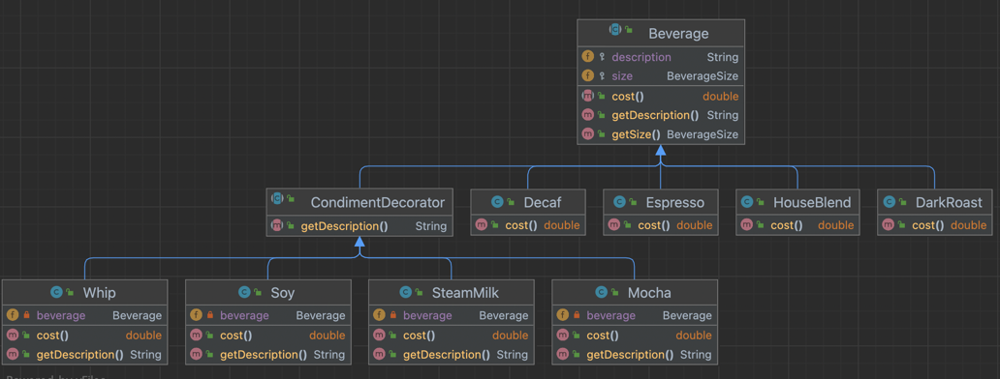

### decorator-patterns

- OCP(Open-Closed-Priciple)
  OCP는 가장 중요한 디자인 원칙

> 클래스는 확장에 대해서는 열려 있어야 하지만 코드 변경에 대해서는 닫혀 있어야 한다.

- 데코레이터 패턴
  상속을 써서 음료 가격과 첨가물(샷, 시럽, 우유 등) 가격을 합한 총 가격을 계산하는 방법은 좋은 방법이 아닙니다.
  클래스가 많아지거나 일부 서브클래스는 접합하지 않은 기능을 베이스 클래스에 추가해야 하는 문제가 있습니다.
  우리는 특정 음료로 시작해서 그 음료를 "장식(decorate)" 할 것입니다.
  예를 들어 모카와 휘핑크림을 추가한 다크 로스트 커피를 주문 한다면 다음과 같은 식으로 할 수 있습니다.

    1. DarkRoast 객체를 가져온다.
    2. Mocha 객체로 장식한다.
    3. Whip 객체로 장식한다.
    4. cost 메서드를 호출한다.
       => 첨가물의 가격을 계산하는 일은 각 객체에 위임된다.

- 데코레이터 패턴 정의

> 데코레이터 패턴에서는 객체에 추가적인 요건을 동적으로 첨가한다.
> 데코레이터는 서브클래스를 만드는 것을 통해서 기능을 유연하게 확장할 수 있는 방법을 제공한다.

- 스타버즈 커피 어플리케이션
  음료(에스프레소, 하우스블렌드 등) 하나에 첨가물(휘핑크림, 두유, 모카 등)을 더한 금액이 자동합산 되는 프로그램



1) Beverage

- 음료 추상 클래스
- 음료 사이즈 필수 입력
- 음료 사이즈 별로 음료 금액 다름
- cost() 와 description()은 각 커피메뉴(서브클래스)에서 구현

2) DarkRoast

- Beverage 구현 클래스
- cost()와 description() 재정의

3) CondimentDecorator

- 첨가물 추상 클래스
- Berverage를 상속 받아 사용
- cost()는 각 첨가물(서브클래스)에서 구현

4) Mocha

- CondimentDecorator, Beverage 구현 클래스
- 원 음료 생성자로 입력 받아 멤버변수에 담는다
- cost()는 원 음료비용 + 첨가물 비용 구현

```java
public abstract class Beverage {

  protected String description = "제목없음";
  protected BeverageSize size;

  public Beverage(BeverageSize size) {
    this.size = size;
  }

  public Beverage() {
    this.size = BeverageSize.TALL;
  }

  public abstract double cost();

  public String getDescription() {
    return description;
  }

  public BeverageSize getSize() {
    return size;
  }

  protected enum BeverageSize {
    TALL, GRANDE, VENTI
  }
}
```

```java
public class DarkRoast extends Beverage {

  public DarkRoast() {
    super();
    this.description = "다크로스트";
  }

  public DarkRoast(BeverageSize size) {
    super(size);
    this.description = "다크로스트";
  }

  @Override
  public double cost() {
    double cost = 1.05;
    if (getSize() == BeverageSize.GRANDE) {
      cost += 0.5;
    }
    if (getSize() == BeverageSize.VENTI) {
      cost += 1.0;
    }
    return cost;
  }
}
```

```java
public abstract class CondimentDecorator extends Beverage {

  public abstract String getDescription();
}

public class Mocha extends CondimentDecorator {

  private Beverage beverage;

  public Mocha(Beverage beverage) {
    this.beverage = beverage;
  }

  @Override
  public double cost() {
    double costBySize = .20;
    if (beverage.getSize() == BeverageSize.GRANDE) {
      costBySize = .25;
    }
    if (beverage.getSize() == BeverageSize.VENTI) {
      costBySize = .30;
    }

    return beverage.cost() + costBySize;
  }

  @Override
  public String getDescription() {
    return beverage.getDescription() + ", 모카";
  }
}
```

- StarbuzzCoffee

```java
public class StarbuzzCoffee {

  public static void main(String[] args) {
    //espresso 주문
    Espresso espressoVenti = new Espresso(BeverageSize.VENTI);
    System.out.println("espressoVenti.getDescription() = " + espressoVenti.getDescription());
    System.out.println("espressoVenti.cost() = " + espressoVenti.cost());

    //dark roast(TALL)에 모카+휘핑크림 주문
    Beverage darkRoast = new DarkRoast();
    darkRoast = new Mocha(darkRoast);
    darkRoast = new Whip(darkRoast);
    System.out.println("darkRoast.getDescription() = " + darkRoast.getDescription());
    System.out.println("darkRoast.cost() = " + darkRoast.cost());

    //dark roast(VENTI)에 모카+휘핑크림 주문
    Beverage darkRoastVenti = new DarkRoast(BeverageSize.VENTI);
    darkRoastVenti = new Mocha(darkRoastVenti);
    darkRoastVenti = new Whip(darkRoastVenti);
    System.out.println("darkRoastVenti.getDescription() = " + darkRoastVenti.getDescription());
    System.out.println("darkRoastVenti.cost() = " + darkRoastVenti.cost());

    //houst blend 두유+모카+휘핑크림 주문
    Beverage houseBlend = new HouseBlend();
    houseBlend = new Soy(houseBlend);
    houseBlend = new Mocha(houseBlend);
    houseBlend = new Whip(houseBlend);
    System.out.println("houseBlend.getDescription() = " + houseBlend.getDescription());
    System.out.println("houseBlend.cost() = " + houseBlend.cost());
  }

}
```

◼︎ 데코레이터 패턴이 적용된 사례

- LineNumberInputStream > BufferedInputStream > FileInputStream
- LineNumberInputStream, BufferedInputStream은 모두 FileInputStream을 확장한 클래스

◼︎ FileInputStream으로 읽은 파일의 문자열을 데코레이터 패턴을 적용해 소문자로 변환하기.

- LowerCaseInputStream

```java
public class LowerCaseInputStream extends FilterInputStream {

  protected LowerCaseInputStream(InputStream in) {
    super(in);
  }

  public int read() throws IOException {
    int read = super.read();
    return read == -1 ? read : Character.toLowerCase((char) read);
  }

  public int read(byte[] b, int offset, int len) throws IOException {
    int read = super.read(b, offset, len);
    for (int i = offset; i < offset + read; i++) {
      b[i] = (byte) Character.toLowerCase((char) b[i]);
    }
    return read;
  }
}

public class LowerCaseInputTest {

  public static void main(String[] args) throws IOException {
    try {
      InputStream in = new FileInputStream(
          "design-patterns/src/main/java/com/study/decorator/inputstream/test.txt");
      in = new BufferedInputStream(in);
      in = new LowerCaseInputStream(in);

      int c;
      while ((c = in.read()) >= 0) {
        System.out.print((char) c);
      }

      in.close();
    } catch (Exception e) {
      e.printStackTrace();
    }
  }
}
```