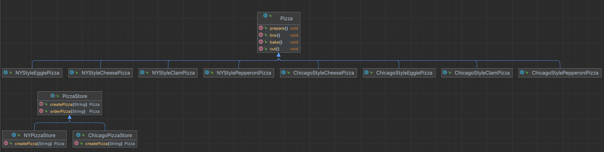
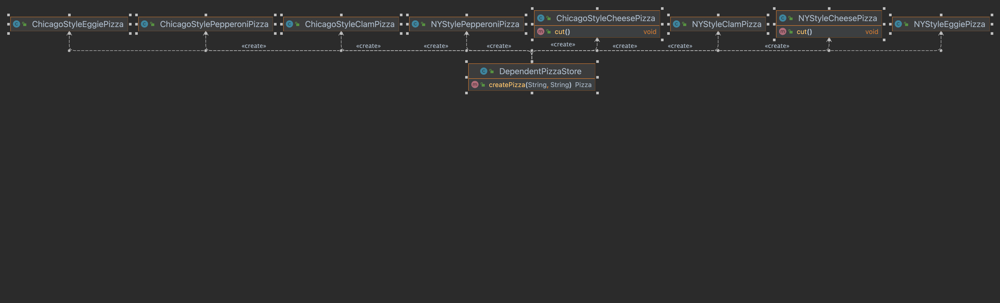
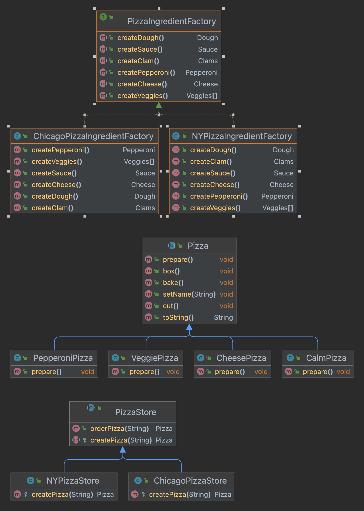

# Factory Patterns

◼︎ 피자가게 어플리케이션 v1

- 바뀌는 부분 파악하기
- 피자 종류별로 피자 주문하기

```java
public class PizzaStore {

  public Pizza orderPizza(String type) {
    Pizza pizza;

    //바뀌는 부분 : 피자 종류 변경(추가/수정/삭제)
    if ("cheese".equals(type)) {
      pizza = new CheesePizza();
    } else if ("pepperoni".equals(type)) {
      pizza = PepperoniPizza();
    } else if ("clam".equals(type)) {
      pizza = ClamPizza();
    } else if ("eggie".equals(type)) {
      pizza = EggiePizza();
    }

    //바뀌지 않는 부분 : 피자 세팅 과정
    pizza.prepare();
    pizza.bake();
    pizza.cut();
    pizza.box();

    return pizza;
  }
}
```

◼︎ 바뀌는 부분 캡슐화

- 간단한 팩토리 패턴

```java
public class SimplePizzaFactory {

  public Pizza createPizza(String type) {
    if ("cheese".equals(type)) {
      return new CheesePizza();
    } else if ("pepperoni".equals(type)) {
      return new PepperoniPizza();
    } else if ("clam".equals(type)) {
      return new ClamPizza();
    } else if ("eggie".equals(type)) {
      return new EggiePizza();
    }

    return null;
  }
}
```

```java
public class PizzaStore {

  private SimplePizzaFactory pizzaFactory;

  public PizzaStore(SimplePizzaFactory pizzaFactory) {
    this.pizzaFactory = pizzaFactory;
  }

  public Pizza orderPizza(String type) {
    Pizza pizza = pizzaFactory.createPizza(type);

    pizza.prepare();
    pizza.bake();
    pizza.cut();
    pizza.box();

    return pizza;
  }
}
```

간단한 팩토리는 디자인 패턴이라 할 수 없다. 자주 쓰이는 관용구에 가깝다.

◼︎ 피자 어플리케이션 v2

- 피자 프랜차이즈 사업 PizzaStore 분점
    - 뉴욕, 시카고 지역에 따라 Pizza 종류 별로 제조방법이 달라짐

- UML



```java
public abstract class PizzaStore {

  public Pizza orderPizza(String type) {
    Pizza pizza = createPizza(type);

    pizza.prepare();
    pizza.bake();
    pizza.cut();
    pizza.box();

    return pizza;
  }

  public abstract Pizza createPizza(String type);
}

public class NYPizzaStore extends PizzaStore {

  @Override
  public Pizza createPizza(String type) {
    if ("cheese".equals(type)) {
      return new NYStyleCheesePizza();
    } else if ("pepperoni".equals(type)) {
      return new NYStylePepperoniPizza();
    } else if ("clam".equals(type)) {
      return new NYStyleClamPizza();
    } else if ("eggie".equals(type)) {
      return new NYStyleEggiePizza();
    }
    return null;
  }
}

public class PizzaTestDrive {

  public static void main(String[] args) {
    PizzaStore nyPizzaStore = new NYPizzaStore();
    Pizza nyCheesePizza = nyPizzaStore.orderPizza("cheese");
    System.out.println("nyCheesePizza = " + nyCheesePizza.name);

    PizzaStore chicagoPizzaStore = new ChicagoPizzaStore();
    Pizza chicagoCheesePizza = chicagoPizzaStore.orderPizza("cheese");
    System.out.println("chicagoCheesePizza = " + chicagoCheesePizza.name);
  }
}

```

- PizzaStore 추상 클래스에서 피자를 주문받은 이후의 행동은 변하지 않는다.
  하지만 PizzaStore 가게 별로 Pizza 만드는 방식은 다르다.
  이를 PizzaStore를 추상클래스로 선언해 orderPizza에서 createPizza를 호출하도록 했고
  createPizza는 각 피자 점포별 서브클래스(NYPizzaStore, ChicagoPizzaStore)에서 정의하도록 추상 메서드로 선언하였다.
  이렇게 했을 때 orderPizza 메서드는 어떤 방식의 피자로 만들어 질지 알지 못한다.
  **캡슐화가 잘 되어 있음**
  ₩> 갈아끼우기 용이하다.
  ₩> 슈퍼클래스의 클라이언트 코드와 서브클래스의 객체생성 코드 분리 가능하다.

◼︎ 팩토리 메서드 패턴

> 팩토리 메서드 패턴에서는 객체를 생성하기 위한 인터페이스를 정의하는데, 어떤 클래스의 인스턴스를 만들지는 서브 클래스에서 결정하게 만듭니다.
> 팩토리 메서드 패턴을 이용하면 클래스의 인스턴스를 만드는 일을 서브클래스에게 맡기는 거죠.

◼ 심하게 의존적인 PizzaStore


```java
public class DependentPizzaStore {

  public Pizza createPizza(String style, String type) {
    Pizza pizza = null;

    if ("NY".equals(style)) {
      if ("cheese".equals(type)) {
        pizza = new NYStyleCheesePizza();
      } else if ("pepperoni".equals(type)) {
        pizza = new NYStylePepperoniPizza();
      } else if ("clam".equals(type)) {
        pizza = new NYStyleClamPizza();
      } else if ("eggie".equals(type)) {
        pizza = new NYStyleEggiePizza();
      }
    } else if ("Chicago".equals(style)) {
      if ("cheese".equals(type)) {
        pizza = new ChicagoStyleCheesePizza();
      } else if ("pepperoni".equals(type)) {
        pizza = new ChicagoStylePepperoniPizza();
      } else if ("clam".equals(type)) {
        pizza = new ChicagoStyleClamPizza();
      } else if ("eggie".equals(type)) {
        pizza = new ChicagoStyleEggiePizza();
      }
    }

    return pizza;
  }
}
```

객체 인스턴스를 직접 만들면 구상클래스에 의존해야 합니다.
︎
◼︎ 의존성 뒤집기 원칙(Dependency Inversion Principle)

- 디자인 원칙

> 추상화된 것에 의존하도록 만들어라.
> 구상클래스에 의존하지 않도록 만들어야 한다.

PizzaStore와 같은 "고수준 구성요소"가 NYStyleCheesePizza와 같은 "저수준 구성요소"를 의존하지 않고 추상 클래스나 인터페이스를 의존하도록 만들어야 한다.
이는 "고수준 구성요소"와 "저수준 구성요소" 모두에 적용될 수 있다.

◼ ︎팩토리 메서드 패턴이 적용된 PizzaStore
고수준 모듈(PizzaStore)와 저수준 모듈(NYStyleCheesePizza)이 추상클래스인 Pizza 만을 의존하고 있음

```java
public abstract class PizzaStore {

  public Pizza orderPizza(String type) {
    Pizza pizza = createPizza(type);

    pizza.prepare();
    pizza.bake();
    pizza.cut();
    pizza.box();

    return pizza;
  }

  protected abstract Pizza createPizza(String type);
}

public class NYStyleCheesePizza extends Pizza {

  public NYStyleCheesePizza() {
    this.name = "NY Style Sauce and Cheese Pizza";
    this.dough = "Thin Crust Dough";
    this.sauce = "Marinara Sauce";

    this.toppings.add("Grated Reggiano Cheese");
  }

  @Override
  public void cut() {
    System.out.println("NYStyleCheesePizza.cut");
  }
}
```

- 디자인 원칙을 지키는데 도움이 되는 가이드라인

1. 어떤 변수에도 구상 클래스에 대한 레퍼런스를 저장하지 않는다.
   ₩> 팩토리 메서드를 써서 구상클래스에 대한 레퍼런스 변수를 저장하지 않도록 한다.
2. 구상클래스 에서 유도된 클래스를 만들지 않는다.
   ₩> 인터페이스나 추상클래스처럼 추상화된 모델로 부터 클래스를 생성해야 한다.
3. 베이스 클래스에 이미 구현되어 있던 메서드를 오버라이드 하지 않는다.
   ₩> 이미 구현되어 있는 메서드를 오버라이드 한다는 것은 베이스 클래스가 제대로 추상화 된 것이 아니라 볼 수 있다.
   베이스 클래스에서 메서드를 정의할 때 모든 서브클래스에서 공유할 수 있는 것만 정의한다.

**어디까지나 가이드라인 일 뿐 실무에서는 유연하게 적용되어야 한다.**

◼︎ 피자 어플리케이션 v3

- 요건 : 피자 분점 별로 원재료를 관리 할 수 있도록 한다.
- 추상 팩토리 패턴으로 구현
- UML


︎

```java
/**
 * PizzaIngredientFactory : 추상 팩터리 인터페이스
 * - 서브클래스에서 원재료 생성 방식 구현하도록 인터페이스 생성
 */
public interface PizzaIngredientFactory {

  Dough createDough();

  Sauce createSauce();

  Cheese createCheese();

  Veggies[] createVeggies();

  Pepperoni createPepperoni();

  Clams createClam();
}

/**
 * NYPizzaIngredientFactory : 추상 팩터리 인터페이스 구현체
 * - 뉴욕 피자 원재료 생성 방식 구현
 */
public class NYPizzaIngredientFactory implements PizzaIngredientFactory {

  @Override
  public Dough createDough() {
    return new ThickCrustDough();
  }

  @Override
  public Sauce createSauce() {
    return new MarinaraSauce();
  }

  @Override
  public Cheese createCheese() {
    return new ReggianoCheese();
  }

  @Override
  public Veggies[] createVeggies() {
    return new Veggies[]{new Garlic(), new Onion(), new Mushroom(), new RedPepper()};
  }

  @Override
  public Pepperoni createPepperoni() {
    return new SlicedPepperoni();
  }

  @Override
  public Clams createClam() {
    return new FreshClams();
  }
}

/**
 * NYPizzaStore - PizzaStore 구현 클래스
 * createPizza 메서드에서 뉴욕점 피자 원재료 방식의 factory 구현체 생성
 * 피자메뉴에 뉴욕 원재료 factory 인터페이스를 파라미터로 넘겨서 각 지점별 뉴욕 원재료 factory를 기준으로 pizza 생성 
 */
public class NYPizzaStore extends PizzaStore {

  @Override
  protected Pizza createPizza(String type) {
    Pizza pizza = null;
    PizzaIngredientFactory nyPizzaIngredientFactory = new NYPizzaIngredientFactory();
    if ("cheese".equals(type)) {
      pizza = new CheesePizza(nyPizzaIngredientFactory);
      pizza.setName("NY cheese pizza");
    } else if ("pepperoni".equals(type)) {
      pizza = new PepperoniPizza(nyPizzaIngredientFactory);
      pizza.setName("NY pepperoni pizza");
    } else if ("clam".equals(type)) {
      pizza = new CalmPizza(nyPizzaIngredientFactory);
      pizza.setName("NY clam pizza");
    } else if ("veggie".equals(type)) {
      pizza = new VeggiePizza(nyPizzaIngredientFactory);
      pizza.setName("NY veggie pizza");
    }

    return pizza;
  }
}

/**
 * Pizza - 추상클래스 선언
 * 멤버변수들은 서브클래스에서 정의할 수 있도록 함
 * >> 지점별 원재료 방식이 다르기 때문
 */
public abstract class Pizza {

  protected String name;
  protected Dough dough;
  protected Sauce sauce;
  protected Veggies[] veggies;
  protected Cheese cheese;
  protected Pepperoni pepperoni;
  protected Clams clam;

  public abstract void prepare();

  public void setName(String name) {
    this.name = name;
  }

  public void bake() {
    System.out.println("Pizza.bake");
  }

  public void cut() {
    System.out.println("Pizza.cut");
  }

  public void box() {
    System.out.println("Pizza.box");
  }

  @Override
  public String toString() {
    return "Pizza{" +
        "name='" + name + '\'' +
        ", dough=" + dough +
        ", sauce=" + sauce +
        ", veggies=" + Arrays.toString(veggies) +
        ", cheese=" + cheese +
        ", pepperoni=" + pepperoni +
        ", clam=" + clam +
        '}';
  }
}

/**
 * CheesePizza - Pizza 구현 클래스
 * 생성자 파라미터로 원재료 factory를 주입받는다.
 * prepare 메서드에서 주입 받은 원재료 factory로 해당 피자를 만든다. 
 * >> 어느 지점의 원재료인지는 모른다 >> 캡슐화가 잘 되어 있다. 
 */
public class CheesePizza extends Pizza {

  private PizzaIngredientFactory pizzaIngredientFactory;

  public CheesePizza(PizzaIngredientFactory pizzaIngredientFactory) {
    this.pizzaIngredientFactory = pizzaIngredientFactory;
  }

  @Override
  public void prepare() {
    System.out.println("CheesePizza.prepare");
    dough = pizzaIngredientFactory.createDough();
    sauce = pizzaIngredientFactory.createSauce();
    cheese = pizzaIngredientFactory.createCheese();
  }
}
```

- 추상 팩토리 패턴
    - 서로 연관된 또는 의존적인 객체들로 이루어진 "제품군"(원재료)을 생성하기 위한 인터페이스를 제공합니다.
    - 객체 구성을 활용합니다. 객체 생성이 팩토리 인터페이스에서 선언한 메서드에서 구현됩니다.