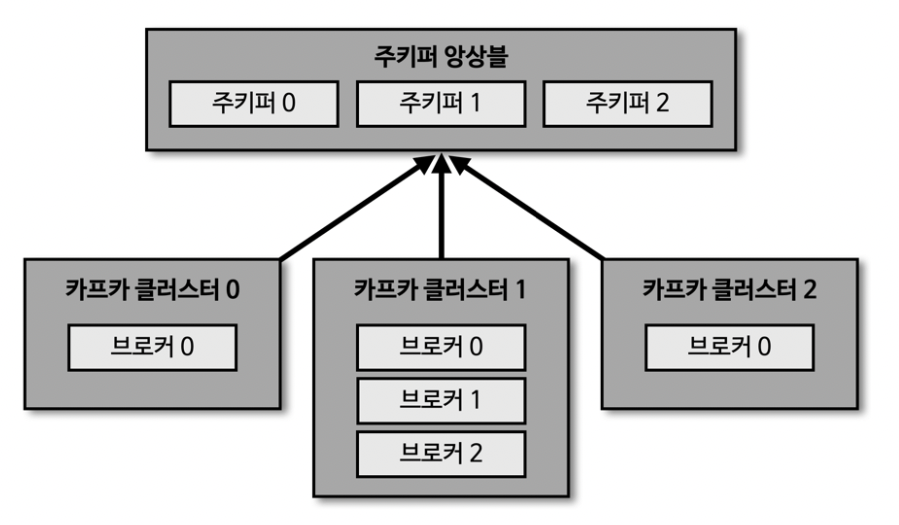
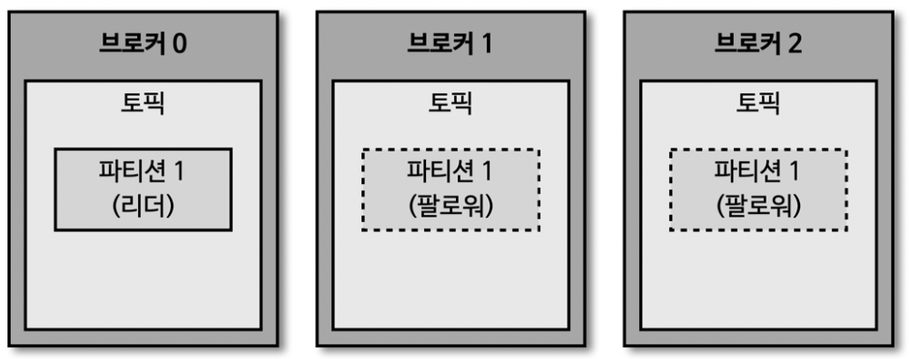
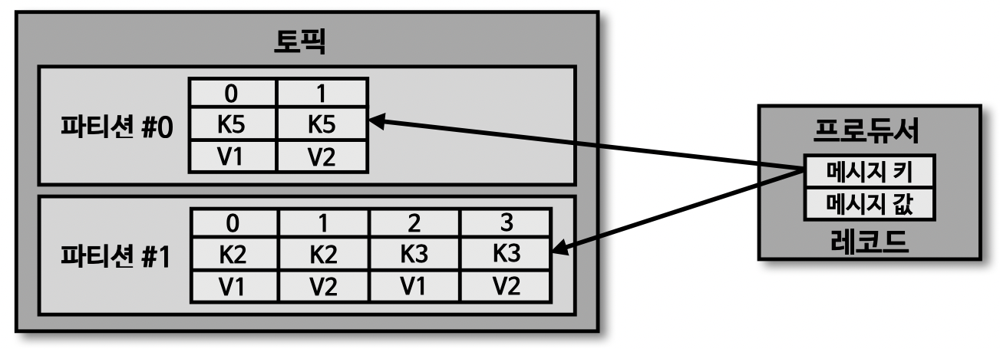

# 카프카의 기본 개념

### 카프카 생태계

- 프로듀서
  - 메세지 큐 송신

- MySQL, AWS S3
  - 소스 커넥트를 통해 메세지 큐 송신

- 카프카 클러스터
  - 카프카 브로커로 구축된 클러스터
  - 브로커 내부의 파티션에서 토픽 메세지 저장

- 컨슈머
  - 메세지 큐 수신

- JDBC, ElasticSearch
  - 싱크 커넥트를 통해 메세지 큐 수신

***
### 주키퍼(1) : 카프카 클러스터(1)

***
### 주키퍼(N) : 카프카 클러스터(N)

- 카프카 클러스터 실행하기 위해 주키퍼가 필요
  - 카프카 3.0 부터는 주키퍼가 없어도 클러스터 동작 가능
  - 하지만 안정성을 위해 주키퍼 사용 권장

***
### 브로커의 역할

**1. 컨트롤러**
- N개의 브로커 중 1개가 컨트롤러 역할
- 컨트롤러는 다른 브로커들의 상태를 체크
- 리더 파티션 장애 발생 시 리더 파티션 재분배
- 컨트롤러 역할 하는 브로커 장애 발생 시 다른 브로커가 자동으로 컨트롤러 역할 수행

**2. 데이터 삭제**
- 컨슈머나 프로듀서는 토픽의 데이터 수정/삭제 불가
- 브로커 만이 토픽의 데이터 삭제 가능
- 데이터 삭제는 파일 단위로 이루어지며, 이 단위롤 로그 세그먼트(log segment) 라고 칭함
- 파일 내부의 특정 레코드만 선별 삭제 불가

**3. 컨슈머 오프셋 저장**
- 컨슈머 그룹은 컨슈머가 파티션의 어느 위치의 레코드 까지 데이터를 수신 했는지 오프셋을 커밋
- 커밋한 오프셋은 __consumer_offsets 토픽에 저장해서 관리
- 여기에 저장된 오프셋을 토대로 컨슈머 그룹은 다음 레코드를 가져가서 처리

**4. 그룹 코디네이터**
- 컨슈머 그룹의 상태를 체크, 파티션을 컨슈머와 매칭되도록 분배하는 역할
- 파티션을 컨슈머와 재할당 하는 과정을 '리밸런스(rebalance)' 라고 칭함

**5. 데이터 저장, 삭제**
- config/server.properties의 log.dir 옵션에 정의한 디렉토리에 데이터 저장

  

- 로그와 세그먼트
  - log.segment.bytes: 바이트 단위의 최대 세그먼트 크기 지정, default : 1GB
  - log.roll.ms(hours) : 세그먼트가 신규 생성된 이후 다음 파일로 넘어가는 주기, default : 7일

  
- 액티브 세그먼트
  - 쓰기가 일어나고 있는 파일을 '액티브 세그먼트' 라고 칭함
  - 액티브 세그먼트는 삭제 대상에 포함되지 않음
  - 액티브 세그먼트가 아닌 세그먼트는 retention 옵션에 따라 삭제 대상- 

- 세그먼트 삭제주기(cleanup.policy=delete)
  - retention.ms(minutes, hours) : 세그먼트 보유 기간, default : 7일
  - retention.bytes : 파티션당 로그 적재 바이트 값, default : -1(지정안함)
  - log.retention.check.interval.ms : 세그먼트가 삭제 영역에 들어왔는지 확인 하는 간격, default : 5분

- 세그먼트 압축(cleanup.policy=compact)
  - 메세지 key 별로 오래된 데이터를 삭제하는 정책
  - delete 정책과 다르게 일부 레코드만 삭제 될 수 있음
  - 액티브 세그먼트가 아닌 세그먼트가 압축 대상
    

  - 테일영역 : 압축 완료된 레코드, 클린 로그 라고도 부른다.
  - 헤더영역 : 압축 전 레코드, 더티 로그 라고도 부른다.
    
  
  - min.cleanable.dirty.ratio 
    
    : 데이터의 압축 시작 시점
    : 0.9로 설정하면 압축 효과는 좋지만, 많은 용량 차지
    : 0.1로 설정하면 압축이 자주 발생하므로 서버 부담 증가, 적은 용량
  
**6. 복제(Replication)**
- 데이터 복제는 카프카를 장애 허용 시스템(fault tolerant system) 의 원동력
- 복제는 파티션 단위로 이루어 진다.
- 토픽을 생성할 때 파티션의 복제 개수 설정
- 최대 값은 브로커 개수 만큼 설정 가능
- 복제된 파티션은 리더 파티션과 팔로워 파티션으로 구성
- 복제 개수 만큼 용량 증가 및 서버 부담 발생
- 그러나 복제를 통해 데이터를 안전하게 사용할 수 있으므로 2~3개의 복제 개수는 필수
    
  

- 브로커에 장애가 발생한 경우
  - 팔로워 파티션 중 하나가 리더 파티션으로 변경된다.

***
### ISR(In-Sync-Replicas)
- ISR은 리더 파티션과 팔로워 파티션이 싱크된 상태를 의미
- unclean.leader.election.enable
  - 리더 파티션의 데이터를 팔로워 파티션에 복제를 못했을 때, 싱크되지 않은 팔로워 파티션이 리더 파티션이 된다면 데이터 유실 발생
  - 유실이 발생하더라도 서비스를 중단하지 않으려면 true 설정
  - 유실 없이 데이터 복제가 이뤄질 때까지 중단 하려면 false 설정

***
### 토픽과 파티션

- 토픽은 데이터를 구분하기 위해 사용하는 단위
- 토픽은 1개 이상의 파티션을 소유
- 파티션에는 프로듀서가 보낸 데이터가 저장됨. 이를 '레코드' 라고 칭함
- 파티션은 FIFO 형태의 큐 구조
  

***
### 토픽 생성 시 파티션 배치 방식

- 파티션이 5개인 토픽을 생성했을 경우 브로커 0번 부터 Round-Robin 방식으로 파티션 생성
- 카프카 클라이언트는 리더 파티션이 있는 브로커와 통신
- 리더 파티션이 골고루 분배 되므로 서버 부담을 덜어주고 선형 확장 가능

  

- 특정 브로커에 파티션이 몰리는 경우 kafka-reassign-partitions.sh 명령으로 파티션 재분배 가능

***
### 파티션 개수와 컨슈머 개수의 처리량

- 파티션은 카프카의 병렬처리 핵심
- 컨슈머의 처리속도 향상을 위한 가장 좋은 방법은 파티션, 컨슈머의 개수를 늘려 스케일 아웃

  

- 파티션 개수를 줄이는 것은 불가능
  - 토픽 생성 시, 파티션 개수는 신중하게 설정 해야 함

***
### 레코드
- 레코드는 타임스탬프, 오프셋, 헤더, 메세지 키, 메세지 값 으로 구성
- 한번 적재된 레코드는 수정 불가
- 타임스탬프
  - default는 레코드 생성 시간
  - message.timestamp.type 설정으로 브로커 적재 시간으로 설정 가능
- 오프셋
  - 브로커 적재 시 오프셋 설정
  - 컨슈머는 오프셋을 기반으로 데이터 처리 대상 구분
- 헤더
  - 데이터 처리에 참고할 만한 정보
- 메세지 키
  - 메세지 값을 분류하기 위한 용도
  - 필수 값이 아님, 없으면 null로 설정 됨
  - 메세지 키가 null이면 Round-Robin 방식으로 파티션에 전달 됨
  - 메세지 키가 null이 아니면 특정 파티션에 전달 됨
- 메세지 값
  - 실질적인 데이터가 담기는 공간
  - 어떤 포맷으로 직렬화 되어있는지 알 수 없으므로 컨슈머는 역직렬화 포맷을 알고 있어야 함

***
### 토픽 이름 제약 조건
- 빈 문자열 불가
- 마침표(.)와 언더바(_)가 동시에 들어가면 안 됨

***
### 토픽 작명 예시
1. <환경>.<팀명>.<애플리케이션명>.<메세지-타입>
   - prd.marketing-team.sms-platform.json
2. <프로젝트명>.<서비스명>.<환경>.<이벤트명>
  - commerece.payment.prd.notification
3. <환경>.<서비스명>.<ZIRA번호>.<메세지-타입>
  - dev.email-sender.jida-1234.emial-vo-custom
4. <카프카클러스터명>.<환경>.<서비스명>.<메시지-타입>
  - aws-kafka.live.marketing-platform.json

***
### 클라이언트 메타데이터

- 카프카 클라이언트는 통신하고자 하는 리더 파티션의 위치를 알기 위해 메타데이터를 브로커로부터 전달 받는다.
- metadata.max.age.ms : 메타데이터 리프레시 간격, default : 5분
- metadata.max.idle.ms : 프로듀서가 유휴 상태일 경우 메타데이터 캐시 유지 기간, default : 5분

  

