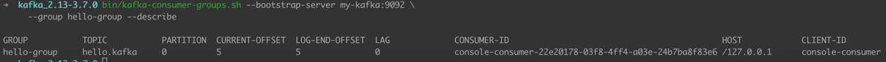
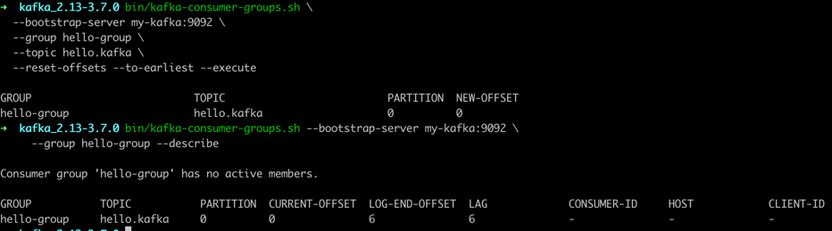

# 아파키 카프카 CLI 활용

### 카프카-주키퍼 실행
1. 주키퍼 실행
    ```shell
    $ bin/zookeeper-server-start.sh config/zookeeper.properties
    ```

2. 카프카(브로커) 실행
    ```shell
    $ bin/kafka-server-start.sh config/server.properties
    ```

3. 카프카 정상 실행 여부 확인

    ```shell
    $ bin/kafka-broker-api-versions.sh --bootstrap-server localhost:9092
    $ bin/kafka-topics.sh --bootstrap-server localhost:9092 --list
    ```
   
***
### kafka-topics.sh

1. 토픽 생성

    ```shell
    $ bin/kafka-topics.sh --create \
      --bootstrap-server my-kafka:9092 \ # 토픽 생성 브로커 서버
      --partitions 10 \ # 파티션 10개 생성
      --replication-factor 1 \ # 파티션 복제 개수 설정
      --retention.ms=172800000 \ # 토픽 데이터 유지 기간
      --topic hello.kafka # 토픽 이름 설정
    ```
   
2. 토픽 상세 조회

    ```shell
    $ bin/kafka-topics.sh --bootstrap-server my-kafka:9092 --topic hello.kafka \
      --describe
    ```

3. 토픽 파티션 개수 변경

    ```shell
    $ bin/kafka-topics.sh --bootstrap-server my-kafka:9092 --topic hello.kafka \
    --alter --partitions 11 # 이전 파티션 10개 보다 높은 숫자로만 설정 가능
    ```
   
***
### kafka-configs.sh

1. 파티션 복제 개수 변경

    ```shell
    $ bin/kafka-configs.sh --bootstrap-server my-kafka:9092 \
    --alter \
    --add-config min.insync.replicas=2 \ # 프로듀서에 정상응답을 위한 ISR이 보장되는 최소 복제 파티션 개수 설정
    --topic hello.kafka 
    ```
   
- 컨플루언트 카프카에서는 acks = ALL, min.insync.replicas=2 설정 권장
  - acks = ALL 은 리더 파티션에서, 팔로워 파티션 까지의 복제(min.insync.replicas 설정 개수)가 잘 이루어 졌는지 까지 검증 후 프로듀서에 정상 응답


2. 브로커 설정 값 조회

   ```shell
   $  bin/kafka-configs.sh --bootstrap-server my-kafka:9092 \
     --broker 0 \
     --all \
     --describe
   ```
   
***
### kafka-console-producer.sh

1. hello.kafka 토픽에 메세지 전송

   ```shell
   $ bin/kafka-console-producer.sh --bootstrap-server my-kafka:9092 \
    --topic hello.kafka
   >hello
   >kafka
   >0
   >1
   ```

2. hello.kafka 토픽에 key를 포함한 메세지 전송

   ```shell
   $ bin/kafka-console-producer.sh --bootstrap-server my-kafka:9092 \
     --topic hello.kafka \
     --property "parse.key=true" \
     --property "key.separator=:"
   >key1:no1
   >key2:no2
   >key3:no3
   ```

***
### kafka-console-consumer.sh

1. hello.kafka 토픽 메세지 수신
   ```shell
   $ bin/kafka-console-consumer.sh \
     --bootstrap-server my-kafka:9092 \
     --topic hello.kafka \
     --from-beginning    # 처음 데이터 부터 수신
   hello
   kafka
   0
   1 
   ```
   
2. hello.kafka 토픽 key 값 포함 메세지 수진

   ```shell
   $ bin/kafka-console-consumer.sh --bootstrap-server  my-kafka:9092 \
     --topic hello.kafka \
     --property print.key=true \
     --property key.separator="-" \
     --from-beginning
   key2-no2
   key2-no2
   key1-no1
   null-1
   null-2
   ```

3. hello.kafka 옵션 포함 메세지 수신

   ```shell
   $ bin/kafka-console-consumer.sh --bootstrap-server my-kafka:9092 \
     --topic hello.kafka \
     --max-messages \ # 최대 consume 메세지 수신
     --partition 2 \ # 특정 파티션 메세지 수신
     --group hello-group \ # hello-group 단위로 메세지 수신, hello-group 단위로 offset 관리 됨 
     --from-beginning
   ```

***
### kakfa-consumer-groups.sh

1. hello-group 컨슈머 그룹 정보 조회

   ```shell
   $ bin/kafka-consumer-groups.sh --bootstrap-server my-kafka:9092 \
     --group hello-group --describe
   ```

   

2. hello-group 컨슈머 그룹 오프셋 리셋

   ```shell
   $ bin/kafka-consumer-groups.sh \
     --bootstrap-server my-kafka:9092 \
     --group hello-group \
     --topic hello.kafka \
     --reset-offsets --to-earliest --execute # 가장 처음 오프셋 으로 리셋
   ```

- --to-earliest : 가장 처음 오프셋으로 리셋
- --to-latest : 가장 마지막 오프셋으로 리셋
- --to-current : 현 시점 기준 오프셋으로 리셋
- --to-datetime {YYYY-MM-DDTHH:mmSS.sss} : 특정 일시로 오프셋 리셋
- --to-offset {long} : 특정 오프셋으로 리셋
- --shift-by {+/- long} : 현재 컨슈머 오프셋에서 앞뒤로 옮겨서 리셋

   

***
### kafka-producer-perf-test.sh

- 카프카 프로듀서로 퍼포먼스를 측정할 때 사용

   ```shell
   $ bin/kafka-producer-perf-test.sh \
  --producer-props bootstrap.servers=my-kafka:9092 \
  --topic hello.kafka \
  --num-records 10 \
  --throughput 1 \
  --record-size 100 \
  --print-metric
   ```
  
***
### kafka-consumer-perf-testsh

- 카프카 컨슈머로 퍼포먼스를 측정할 때 사용

   ```shell
   $ bin/kafka-consumer-perf-test.sh \
     --bootstrap-server my-kafka:9092 \
     --topic hello.kafka \
     --messages 10 \
     --show-detailed-stats
   ```
  
***
### kafka-reassign-partitions.sh

- 리더-팔로워 파티션 위치를 변경한다.
- auto.leader.rebalance.enable 옵션이 true(기본값) 이면 자동 리밸런싱을 수행한다.

    ```json
    $ cat partitions.json
    
    {
        "partitions":
        [ {   "topic": "hello.kafka", "partition": 0, "replicas": [ 0 ] } ]
        ,"version": 1
    }
    ```
    
    ```shell
    $ bin/kafka-reassign-partitions.sh --zookeeper my-kafka:2181 \
      --reassignment-json-file partitions.json --execute
    ```

***
### 토픽을 생성하는 2가지 방법

1. 카프카 컨슈머 또는 프로듀서가 브로커에 생성되지 않은 토픽에 대해 데이터를 요청할 때 자동 생성
   - server.properties의 토픽 기본 설정값으로 생성 됨

2. 사용자가 커맨더 라인 툴로 명시적으로 토픽 생성
   - 사용자가 옵션 설정 가능
   - 토픽마다 비즈니스에 맞는 옵션 값 설정 필요
   - 예를 들어 데이터 처리량이 많은 토픽의 경우 파티션의 개수를 높게 설정, 반대의 경우 낮게 설정


