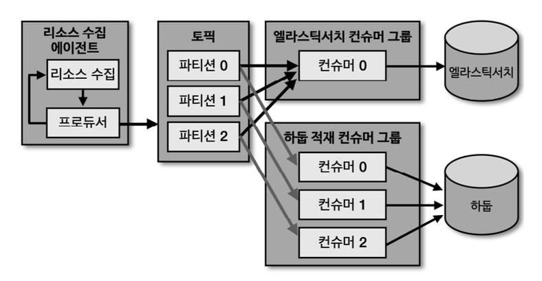

# 카프카 컨슈머 어플리케이션 개발

### 컨슈머 내부구조


- Fetcher : 리더 파티션으로부터 레코드들을 미리 가져와서 대기
- poll() : Fetcher 에 있는 레코드들을 리턴
- ConsumerRecords : 처리하고자 하는 레코드들의 모음. 오프셋 포함

***
### 컨슈머 그룹


- 컨슈머를 컨슈머 그룹 단위로 격리된 환경에서 안정적으로 운영 가능
- 컨슈머 그룹으로 묶인 컨슈머들은 토픽의 1개 이상 파티션들에 할당 되어서 데이터를 수신
- 파티션(N) : 컨슈머(1) 구조
- 파티션(1) : 컨슈머(1) 일 때 처리 성능 향상

***
### 컨슈머 그룹을 활용하는 이유


- 서버 리소스 정보를 수집하는 에이전트
- 수집된 리소스 정보를 동기 방식으로 엘라스틱 서치 > 하둡 순으로 저장
- 엘라스틱 서치나 하둡 중 장애 발생하면? 에이전트 다운 현상 발생

***
### 카프카 컨슈머 그룹을 활용하면?



- 다른 저장소에 저장하는 컨슈머를 컨슈머 그룹으로 묶음으로써 각 저장소의 장애에 격리되어 운영
- 엘라스틱 서치에 장애 발생하더라도 하둡에는 문제 없음
- 엘라스틱 서치 장애 해소 시 마지막 오프셋 이후부터 다시 적재 수행

***
### 리밸런싱


- 컨슈머 그룹으로 이루어진 컨슈머 중 일부 컨슈머에 장애 발생/해소 시, 파티션의 컨슈머 변경이 일어남.
- 이를 '리밸런싱' 이라고 칭함
- 리밸런싱 2가지 상황에서 일어남
- 컨슈머 추가, 컨슈머 제외

***
### 커밋


- 컨슈머는 카프카 브로커로부터 데이터를 어디까지 가져갔는지 커밋을 통해 기록
- 카프카 브로커 내부 토픽(__consumer_offsets) 에 기록
- 컨슈머 장애 발생으로 마지막 커밋 시점을 기록하지 못한다면, 데이터 중복 처리 발생할 수 있음
- 따라서 컨슈머 어플리케이션이 오프셋 커밋을 정상처리 했는지 검증 필요

***
### Assignor

- 컨슈머와 파티션 할당 정책은 컨슈머의 Assignor 에 의해 결정됨
- Assignor 방식
  - RangeAssignor : 파티션을 숫자로 정렬, 컨슈머를 abc순으로 정렬 해서 순서대로 할당. **default**
  - RoundRobinAssignor : 모든 파티션을 컨슈머에 번갈아가면서 할당
  - StickyAssignor : 최대한 파티션을 균둥하게 배분하면서 할당(할당 방식은 RoundRobin과 동일)
- 컨슈머와 파티션은 성능 최적화를 위해 보통 1:1 매칭 규칙을 맞추기 때문에 큰 이슈 없음

***
### 컨슈머 필수 옵션
- bootstrap.servers : 컨슈머가 수신할 대상 카프카 클러스터에 속한 브로커의 호스트 이름:포트를 1개 이상 작성
- key.deserializer : 메세지 키를 역직렬화 하는 클래스 지정
- key.deserializser : 메세지 값을 역직렬화 하는 클래스 지정

***
### 컨슈머 선택 옵션

- group.id : 컨슈머 그룹 아이디를 지정. **subscribe() 메서드로 토픽을 구독할 경우 필수**
- auto.offset.reset : 컨슈머 그룹이 특정 파티션을 읽을 때 저장된 컨슈머 오프셋이 없는 경우, 어느 오프셋 부터 읽을 지 선택. **기본값은 latest**
- enable.auto.commit : 자동커밋 사용여부 옵션. **기본값은 true**
- auto.commit.interval.ms : 자동커밋 일 경우 오프셋 커밋 간격 지정. **기본값은 5초**
- max.poll.records : poll() 메서드를 통해 반환되는 레코드 개수 지정. **기본값은 500**
- session.timeout.ms : 컨슈머가 브로커와 연결이 끊기는 최대 시간. **기본값은 10초**
- heartbeat.interval.ms : 컨슈머와 브로커가 정상 연결 체킹 시간. **기본값은 3초**
- max.poll.interval.ms : poll() 메서드 호출하고 커밋할 때 까지의 최대 대기 시간. **기본값은 5분**
- isolation.level : 트랜잭션 프로듀서가 레코드를 트랜잭션 단위로 보낼 경우 사용

***
### 동기 오프셋 수동 커밋 컨슈머

- poll() 메서드로 받은 모든 레코드의 처리가 끝난 후 commitSync() 메서드 호출

```java
public class ConsumerWithSyncCommit {
    private final static Logger logger = LoggerFactory.getLogger(ConsumerWithSyncCommit.class);
    private final static String TOPIC_NAME = "test";
    private final static String BOOTSTRAP_SERVERS = "my-kafka:9092";
    private final static String GROUP_ID = "test-group";

    public static void main(String[] args) {
        Properties configs = new Properties();
        configs.put(ConsumerConfig.BOOTSTRAP_SERVERS_CONFIG, BOOTSTRAP_SERVERS);
        configs.put(ConsumerConfig.GROUP_ID_CONFIG, GROUP_ID);
        configs.put(ConsumerConfig.KEY_DESERIALIZER_CLASS_CONFIG, StringDeserializer.class.getName());
        configs.put(ConsumerConfig.VALUE_DESERIALIZER_CLASS_CONFIG, StringDeserializer.class.getName());
        configs.put(ConsumerConfig.ENABLE_AUTO_COMMIT_CONFIG, false);

        KafkaConsumer<String, String> consumer = new KafkaConsumer<>(configs);
        consumer.subscribe(Arrays.asList(TOPIC_NAME));

        while (true) {
            ConsumerRecords<String, String> records = consumer.poll(Duration.ofSeconds(1));
            for (ConsumerRecord<String, String> record : records) {
                logger.info("record:{}", record);
            }
            consumer.commitSync();  // 레코드 처리 종료 후 commit
        }
    }
}
```

***
### 동기 오프셋 수동 커밋 컨슈머(레코드 단위)

```java
while (true) {
    ConsumerRecords<String, String> records = consumer.poll(Duration.ofSeconds(1));
    Map<TopicPartition, OffsetAndMetadata> currentOffset = new HashMap<>();

    for (ConsumerRecord<String, String> record : records) {
        logger.info("record:{}", record);
        currentOffset.put(
                new TopicPartition(record.topic(), record.partition()),
                new OffsetAndMetadata(record.offset() + 1, null));
        consumer.commitSync(currentOffset); // 레코드 loop 안에서 레코드 단위로 commit
    }
}
```

***
### 비동기 오프셋 수동 커밋 컨슈머

```java
while (true) {
    ConsumerRecords<String, String> records = consumer.poll(Duration.ofSeconds(1));
    for (ConsumerRecord<String, String> record : records) {
        logger.info("record:{}", record);
    }
    //비동기 commitAsync, 콜백 응답 로직 재정의
    consumer.commitAsync(new OffsetCommitCallback() {
        public void onComplete(Map<TopicPartition, OffsetAndMetadata> offsets, Exception e) {
            if (e != null)
                System.err.println("Commit failed");
            else
                System.out.println("Commit succeeded");
            if (e != null)
                logger.error("Commit failed for offsets {}", offsets, e);
        }
    });
}
```

***
### 리밸런스 리스너를 가진 컨슈머

- 리밸런스 발생을 감지하는 ConsumerRebalanceListener 인터페이스 지원
  - onPartitionAssigned() : 리밸런스가 끝난 뒤 호출
  - onPartitionRevoked() : 리밸런스 시작 전 호출 
  - 마지막 처리 레코드를 기준으로 커밋하기 위해 리밸런스 시작 직전에 커밋 
     => onPartitionRevoked() 커밋 구현

```java
public class RebalanceListener implements ConsumerRebalanceListener {
    private final static Logger logger = LoggerFactory.getLogger(RebalanceListener.class);

    public void onPartitionsAssigned(Collection<TopicPartition> partitions) {
        logger.warn("Partitions are assigned : " + partitions.toString());

    }

    public void onPartitionsRevoked(Collection<TopicPartition> partitions) {
        logger.warn("Partitions are revoked : " + partitions.toString());
    }
}
```

***
### 특정 파티션 할당 컨슈머

```java
public class ConsumerWithExactPartition {
    private final static Logger logger = LoggerFactory.getLogger(ConsumerWithExactPartition.class);
    private final static String TOPIC_NAME = "test";
    private final static int PARTITION_NUMBER  = 0;
    private final static String BOOTSTRAP_SERVERS = "my-kafka:9092";

    public static void main(String[] args) {
        Properties configs = new Properties();
        configs.put(ConsumerConfig.BOOTSTRAP_SERVERS_CONFIG, BOOTSTRAP_SERVERS);
        configs.put(ConsumerConfig.KEY_DESERIALIZER_CLASS_CONFIG, StringDeserializer.class.getName());
        configs.put(ConsumerConfig.VALUE_DESERIALIZER_CLASS_CONFIG, StringDeserializer.class.getName());

        KafkaConsumer<String, String> consumer = new KafkaConsumer<>(configs);
        consumer.assign(Collections.singleton(new TopicPartition(TOPIC_NAME, PARTITION_NUMBER))); // 특정 파티션 할당
        while (true) {
            ConsumerRecords<String, String> records = consumer.poll(Duration.ofSeconds(1));
            for (ConsumerRecord<String, String> record : records) {
                logger.info("record:{}", record);
            }
        }
    }
}
```

***
### 컨슈머의 안전한 종료

- 컨슈머를 안전하게 종료하기 위해 KafkaConsumer 클래스에서 wakeup() 메서드 지원

```java
public class ConsumerWithSyncOffsetCommit {
    private final static Logger logger = LoggerFactory.getLogger(ConsumerWithSyncOffsetCommit.class);
    private final static String TOPIC_NAME = "test";
    private final static String BOOTSTRAP_SERVERS = "my-kafka:9092";
    private final static String GROUP_ID = "test-group";
    private static KafkaConsumer<String, String> consumer;

    public static void main(String[] args) {
        Runtime.getRuntime().addShutdownHook(new ShutdownThread());

        Properties configs = new Properties();
        configs.put(ConsumerConfig.BOOTSTRAP_SERVERS_CONFIG, BOOTSTRAP_SERVERS);
        configs.put(ConsumerConfig.GROUP_ID_CONFIG, GROUP_ID);
        configs.put(ConsumerConfig.KEY_DESERIALIZER_CLASS_CONFIG, StringDeserializer.class.getName());
        configs.put(ConsumerConfig.VALUE_DESERIALIZER_CLASS_CONFIG, StringDeserializer.class.getName());
        configs.put(ConsumerConfig.ENABLE_AUTO_COMMIT_CONFIG, false);

        consumer = new KafkaConsumer<>(configs);
        consumer.subscribe(Arrays.asList(TOPIC_NAME));

        try {
            while (true) {
                ConsumerRecords<String, String> records = consumer.poll(Duration.ofSeconds(1));
                for (ConsumerRecord<String, String> record : records) {
                    logger.info("{}", record);
                }
                consumer.commitSync();
            }
        } catch (WakeupException e) {
            logger.warn("Wakeup consumer"); // 프로세스 비정상 종료 감지
        } finally {
            logger.warn("Consumer close");
            consumer.close();   // 컨슈머 정상 종료
        }
    }

    static class ShutdownThread extends Thread {
        public void run() {
            logger.info("Shutdown hook");
            consumer.wakeup();
        }
    }
}
```

***
### 멀티스레드 컨슈머


- 컨슈머 그룹 A : N개의 컨슈머 프로세스 기동
- 컨슈머 그룹 B : 1개의 컨슈머 프로세스에서 N개의 컨슈머 스레드 생성
- 그룹 A는 프로세스 1개가 죽더라도 다른 2개의 프로세스로 처리가 되지만, 배포 프로세스가 복잡함
- 그룹 B는 프로세스 1개 죽으면 전체 프로세스가 죽음. 배포 프로세스 간편함

***
### 컨슈머 랙


- 파티션의 최신 오프셋(LOG-END-OFFSET)과 컨슈머 오프셋(CURRENT-OFFSET) 간의 차이
- 컨슈머 랙은 컨슈머가 정상동작하는 지 여부를 파악하는 가장 확실한 지표
- 따라서 컨슈머 애플리케이션을 운영한다면 반드시 필요한 모니터링 지표


- 컨슈머 랙은 컨슈머 그룹과 파티션 별로 생성
- 3개의 파티션이 있고 1개의 컨슈머 그룹이 토픽을 구독한다면 컨슈머 랙은 총 3개가 됨

***
### 컨슈머 랙 - 프로듀서와 컨슈머의 데이터 처리량


- 컨슈머 랙이 크다는 것은 컨슈머 처리가 지연되고 있음을 의미
- 컨슈머 랙이 0에 가까우면 지연 없이 바로바로 처리 되고 있음을 의미

***
### 컨슈머 랙 모니터링

- 컨슈머 랙을 모니터링 함으로써 컨슈머의 장애 확인 및 대응 가능
- 컨슈머가 프로듀서 데이터 처리량을 따라가지 못한다면?
  - 파티션가 컨슈머의 개수르 늘려 컨슈머 처리량을 높여준다
- 특정 파티션에만 컨슈머 랙이 늘어나는 상황이라면?
  - 해당 파티션에 매칭된 컨슈머에 이슈가 있음을 의미

***
### 컨슈머 랙 모니터링 방법

1. kafka-consumer-groups.sh 명령어
    ```shell
    $ bin/kafka-consumer-groups.sh --bootstrap-server my-kafka:9092 \
      --group my-group --describe
    ```

2. 컨슈머 어플리케이션에서 metrics() 메서드 사용

    ```java
    for (Map.Entry<MetricName, ? extends Metric> entry :
    kafkaConsumer.metrics().entrySet()) {
        if ("records-lag-max".equals(entry.getKey().name()) |
                "records-lag".equals(entry.getKey().name()) |
                "records-lag-avg".equals(entry.getKey().name())) {
            Metric metric = entry.getValue();
            logger.info("{}:{}", entry.getKey().name(), metric.metricValue());
        }
    }
    ```

3. 외부모니터링 툴 사용
- 컨슈머 랙을 확인할 수 있는 가장 최상의 방법
- 데이터 독(Datadog), 컨플루언트 컨트롤 센터(Confluent Control Center) 와 같은 종합 모니터링 툴에서 확인 가능
- 컨슈머 랙 모니터링 만을 위한 오픈소스 프로젝트 버로우(Burrow) 도 있음

***
### 카프카 버로우


- REST API를 통해 카프카 클러스터의 컨슈머 그룹 별로 컨슈머 랙을 확인 가능

***
### 카프카 버로우 컨슈머 랙 이슈 판별

- 카프카 버로우에서는 단순한 임계치 터치로 장애 처리를 하지 않고 슬라이딩 윈도우 계산을 통해 장애 처리 지원
- 컨슈머 랙의 상태를 표현하는 것을 '컨슈머 랙 평가(evaluation)' 으로 칭함
- 파티션의 상태를 OK, STALLED, STOPPED 로 나눈다
- 컨슈머의 상태를 OK, WARNING, ERROR 로 나눈다

***
### 파티션 OK, 컨슈머 WARNING 상태


- 컨슈머 처리량이 프로듀서 처리량을 따라가지 못하는 상태

***
### 파티션 STALLED, 컨슈머 ERROR 상태


- 컨슈머가 멈춘 상태
- 이메일, SMS, 슬랙 등 알람 수신 설정 필요, 즉각 조치 필요

***
### 컨슈머 랙 모니터링 아키텍처


