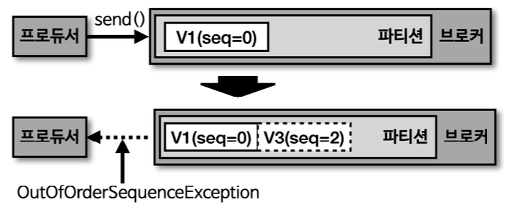

# 멱등성 프로듀서, 트랜잭션 프로듀서와 컨슈머

### 멱등성이란?

- 멱등성이란 여러번 연산을 수행하더라도 동일한 결과가 나타나는 것을 의미
- 멱등성 프로듀서는 동일한 데이터를 여러번 전송 하더라도 단 한번만 저장됨을 의미
- 기본 프로듀서의 동작 방식 : 적어도 한번 이상 전달(At least once)
- 적어도 한번 이상 전달은 2번 이상 적재할 가능성이 있으므로 데이터 중복이 발생할 수 있다.

- 프로듀서 동작 방식 종류
  - At least once : 적어도 한번 이상 전달
  - At most once : 최대 한번 전달
  - Exactly once : 정확히 한번 전달

***
### 멱등성 프로듀서

- enable.idempotence 옵션을 사용하여 정확히 한번 전달(exactly once) 지원
- enable.idempotence 옵션의 기본 값은 false 이며, true로 설정하면 멱등성 프로듀서로 동작
- **카프카 3.0.0 부터는 enable.idempotence 옵션의 기본 값은 true(acks=all)로 변경 되었음**

***
### 멱등성 프로듀서의 동작

- 멱등성 프로듀서는 PID(Producer Unique ID) 와 SID(Sequence ID)를 함께 전달
- 브로커는 PID와 SID를 확인하여 동일한 메세지의 적재 요청이 오더라도 단 한번만 데이터를 적재
- PID : 프로듀서의 고유한 ID
- SID : 레코드 전달 ID

***
### 멱등성 프로듀서가 아닌 경우(기본 프로듀서)


- 장애 발생 시 데이터 중복 적재 가능성 있음

***
### 멱등성 프로듀서 인 경우


- 장애 발생 해서 2번 전송 하더라도 PID와 SID를 식별해 데이터 1건 저장(멱등성) 보장

***
### 멱등성 프로듀서의 한계

- 프로듀서 재기동할 경우 PID가 달리지기 때문에 멱등성 프로듀서 라도 멱등성 보장이 되지 않음을 유의

***
### 멱등성 프로듀서 옵션

- retries(프로듀서 재전송 시도 횟수) : Integer.MAX_VALUE
- acks : all(팔로워 파티션 복제 후 정상 응답)
- 이렇게 설정되는 이유는 프로듀서가 적어도 1번 이상 브로커에 데이터를 보내면서 데이터가 단 한번만 적재 되는 것을 보장하기 위해

***
### 멱등성 프로듀서 사용 시 오류 확인



- 예상된 시퀀스 넘버와 다른 번호의 시퀀스가 전송 됬을 때 OutOfOrderSequenceException 발생
- 프로듀서 에서 해당 오류가 발생할 경우에 대한 대응 방안 고려 필요
- 자주 발생하는 케이스는 아님

***
### Kafka Exactly Once Semantics

- 멱등성 프로듀서 방식 이 외에도 Kafka 에서는 정확히 한 번(Exactly Once) 전송을 보장하는 다른 방법이 있음
- 컨슈머 어플리케이션 단에서 메세지의 Key를 DB에 저장 해서 N건 저장을 방지
  - 메세지 값에 Key를 정의하는 규약 필요

***
### 트랜잭션 프로듀서의 동작


- 다수의 파티션에 데이터를 저장할 경우 모든 데이터에 대해 동일한 원자성(atomic)을 만족시키는 데 사용
- 트랜잭션으로 묶은 데이터를 전체 처리하거나 전체 처리하지 않음을 의미
- 트랜잭션 시작과 끝을 표현하는 트랜잭션 레코드를 하나 더 전송

***
### 트랜잭션 컨슈머의 동작


- 파티션에 저장된 트랜잭션 레코드의 commit(완료) 을 확인 후 데이터 수신
- 트랜잭션 레코드는 실질적인 데이터는 갖고 있지 않으며, 트랜잭션이 끝난 상태를 표시하는 정보를 갖고 있음

***
### 트랜잭션 프로듀서 설정

- 프로듀서 별로 고유한 transaction.id 설정 필요
- init, begin, commit 순으로 트랜잭션 수행

```java
configs.put(ProducerConfig.TRANSACTIONAL_ID_CONFIG, UUID.randomUUID());

Producer<String, String> producer = new KafkaProducer<>(configs);

producer.initTransactions();

producer.beginTransaction();
producer.send(new ProducerRecord<>(TOPIC, "전달하는 메시지 값")); 
producer.commitTransaction();

producer.close();
```

***
### 트랜잭션 컨슈머 설정

- isolation.level 옵션 설정 필요
  - read_commited : 완료된 커밋 만을 수신
  - **read_uncommited(default)** : 커밋 여부와 상관 없이 수신

```java
configs.put(ConsumerConfig.ISOLATION_LEVEL_CONFIG, "read_committed");
KafkaConsumer<String, String> consumer = new KafkaConsumer<>(configs);
```


