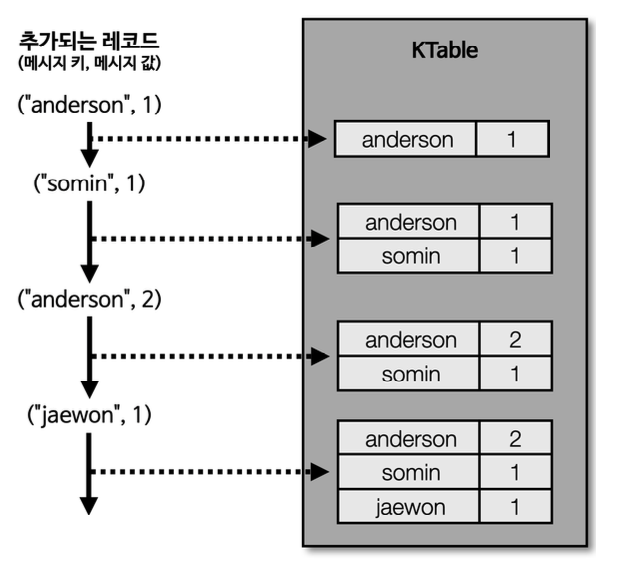

# 카프카 스트림즈


- 토픽에 적재된 데이터를 실시간으로 다른 토픽에 적재하는 라이브러리
- 브로커의 장애가 발생 하더라도 정확히 한번(exactly once) 적재 하도록 장애 허용 시스템을 갖고 있어 안정성이 우수하다


***
### 스트림즈 내부 구조


- 스트림즈는 내부적으로 1개 이상의 스레드를 생성 할 수 있으며, 스레드는 1개 이상의 태스크를 갖는다.
- 태스크(task)는 스트림즈 데이터 처리의 최소 단위 이다.
- 만약 3개의 파티션으로 이루어진 토픽을 처리하는 스트림즈 라면 내부에 3개의 태스크가 생성된다.
- 컨슈머 스레드를 늘리는 방법과 동일하게 병렬 처리르 위해 파티션가 스트림즈 스레드(또는 프로세스) 개수를 늘림으로써 처리량을 늘릴 수 있다.


***
### 스트림즈 스케일 아웃


- 장애가 발생하더라도 2개 이상의 서버로 구성하여 스트림즈 애플리케이션을 운영한다.
- 이를 통해 장애가 발생하더라도 안전하게 스트림 처리 할 수 있다.

***
### 토폴로지


- 스트림즈 에서는 트리형 토폴로지를 사용한다.

***
### 프로세서와 스트림


- 스트림즈 에서는 토폴로지를 이루는 노드를 하나의 프로세서(processor) 라고 부른다.
- 노드와 노드를 잇는 선을 스트림(stream) 이라고 부른다.
- 스트림은 토픽의 데이터를 뜻한다. 프로듀서와 컨슈머에서 활용했던 레코드와 동일하다.
- 소스 프로세서는 데이터를 처리하기 최초로 선언하는 노드, 하나 이상의 토픽에서 데이터를 가져오는 역할
- 스트림 프로세서는 다른 프로세서가 반환한 데이터를 처리하는 역할, 변환/분기 처리 같은 로직이 존재
- 싱크 프로세서는 데이터를 특정 카프카 토픽으로 저장하는 역할, 스트림즈로 처리된 데이터의 최종 종착지

***
### 스트림즈 DSL 과 프로세서 API

- 스트림즈 DSL(Domain Specific Language) 과 프로세서 API 2가지 방법으로 개발 가능하다.
- 스트림즈 DSL 은 스트림 프로세싱에 쓰일 만한 다양한 기능들을 자체 API 로 만들어 놓았기 때문에 대부분의 변환 로직을 어렵지 않게 개발 할 수 있다.
- 스트림즈 DSL 에서 제공하지 않는 일부 기능들의 경우 프로세서 API 를 사용하여 구현할 수 있다.


1. 스트림즈 DSL 로 구현하는 데이터 처리 예시
    - 메시지 값을 기반으로 토픽 분기 처리
    - 지난 10분간 들어온 데이터의 개수 집계
   
2. 프로세서 API 로 구현하는 데이터 처리 예시
    - 메시지 값의 종류에 따라 토픽을 가변적으로 전송
    - 일정한 시간 간격으로 데이터 처리

***
## 스트림즈 DSL

- 스트림즈 DSL 에는 레코드의 흐름을 추상화한 3가지 개념이 존재한다.
- KStream, KTable, GlobalKTable 이 있다.

***
### KStream


- 레코드의 흐름을 표현
- 메시지 키와 메시지 값으로 구성
- 데이터를 조회하면 토픽에 존재하는 모든 레코드가 출력 된다
- KStream 은 컨슈머로 토픽을 구독하는 것과 동일한 선상에서 사용 하는 것이라 볼 수 있다.

***
### KTable



- 메시지 키를 기준으로 묶어서 사용
- 유니크한 메시지 키를 기준으로 가장 최신 레코드를 사용
- 데이터를 조회하면 메시지 키를 기준으로 가장 최신에 추가된 레코드의 데이터가 출력 된다
- 동일한 메시지 키를 새로 적재할 경우 기존의 메시지 키의 값이 새로운 메시지 값으로 업데이트 된다

***
### 코파티셔닝


- KStream과 KTable을 조인하려면 반드시 코파티셔닝 이 되어 있어야 한다.
- 코파티셔닝이란? 조인을 하는 2개의 데이터의 파티션 개수가 동일하고 파티셔닝 전략을 동일하게 맞추는 작업이다.
- 파티션 개수가 동일하고 파티셔닝 전략이 같은 경우, 동일한 메시지 키를 가진 데이터가 동일한 태스크에 들어가는 것을 보장한다.
- 이를 통해 각 태스크는 KStream의 레코드와 KTable의 메시지 키가 동일할 경우 조인을 수행할 수 있다.

***
### 코파티셔닝 되지 않은 2개 토픽 이슈


- KStream과 KTable을 사용하는 2개의 토픽이 파티션의 개수가 다르거나 파티션 전략이 다를 때
- 카프카 스트림즈 애플리케이션에서 조인을 수행할 경우 TopologyException이 발생한다.

***
### GlobalKTable


- 코파티셔닝이 되지 않은 KStream 과 KTable 을 조인해서 사용하고 싶다면 Ktable을 GlobalKTable로 선언하면 된다.
- GlobalKTable 은 코파티셔닝 되지 않은 KStream 과 데이터 조인을 할 수 있다.
- GlobalKTable 은 KTable 과 다르게 모든 태스크에 동일하게 공유 되어 사용되기 때문

***
### 스트림즈 DSL 필수 옵션
- application.id : 스트림즈 어플리케이션을 구분하기 위한 고유 아이디 설정

***
### 스트림즈 DSL 선택 옵션
- default.key.serde : 레코드의 메시지 키를 직렬화, 역직렬화 하는 클래스, 기본값은 바이트
- default.value.serde : 레코드의 메시지 값을 직렬화, 역직렬화 하는 클래스, 기본값은 바이트
- num.stream.threads : 스트림 프로세싱 실행 시 실행될 스레드 개수, 기본값은 1
- state.dir : 상태 기반 데이터 처리를 할 때 데이터를 저장할 디렉터리, 기본값은 /tmp/kafka-streams

***
### 필터링 스트림즈 어플리케이션 개발


- 토픽으로 들어온 문자열 데이터 중 문자열의 길이가 5보다 큰 경우만 필터링 하는 스트림즈 어플리케이션
- 메시지 키 또는 메시지 값을 필터링 하여 조건에 맞는 데이터를 골라 낼 때는 스트림즈 DSL의 filter 메서드를 사용

```java
public class StreamsFilter {

    private static String APPLICATION_NAME = "streams-filter-application";
    private static String BOOTSTRAP_SERVERS = "my-kafka:9092";
    private static String STREAM_LOG = "stream_log";
    private static String STREAM_LOG_FILTER = "stream_log_filter";

    public static void main(String[] args) {

        Properties props = new Properties();
        props.put(StreamsConfig.APPLICATION_ID_CONFIG, APPLICATION_NAME);
        props.put(StreamsConfig.BOOTSTRAP_SERVERS_CONFIG, BOOTSTRAP_SERVERS);
        props.put(StreamsConfig.DEFAULT_KEY_SERDE_CLASS_CONFIG, Serdes.String().getClass());
        props.put(StreamsConfig.DEFAULT_VALUE_SERDE_CLASS_CONFIG, Serdes.String().getClass());

        StreamsBuilder builder = new StreamsBuilder();
        KStream<String, String> streamLog = builder.stream(STREAM_LOG);

        //stream_log 토픽의 메시지 값의 길이가 5보다 클 경우 stream_log_filter 토픽에 저장
        streamLog.filter((key, value) -> value.length() > 5).to(STREAM_LOG_FILTER);


        KafkaStreams streams;
        streams = new KafkaStreams(builder.build(), props);
        streams.start();

    }
}
```

***
### 스트림즈 DSL - KTable 과 KStream 을 join()


- KTable 과 KStream 을 메시지 키를 기준으로 조인
- 사용자의 이벤트 데이터를 데이터베이스에 저장하지 않고도 스트리밍 조인 처리 가능

***


- 키(이름):값(주소) 의 KTable / 키(이름):값(물품) 의 KStream 이 있을 때
- 스트림즈 애플리케이션에서 키(이름) 로 join 을 수행하면 주소와 물품이 조합된 데이터를 새로 생성 할 수 있다

***


- 만약 사용자의 주소가 바뀐다면?
- KTable은 동일한 메시지 키가 들어올 경우 최신 데이터로 업데이트 되기 때문에
- 바뀐 주소로 조인이 수행된다.

***
### KTable-KStream 조인 테스트


1. 토픽 생성
   ```shell
   # address 토픽 생성
   $ bin/kafka-topics.sh --create --bootstrap-server my-kafka:9092 \
   --partitions 3 \
   --topic address
   
   # order 토픽 생성
   $ bin/kafka-topics.sh --create --bootstrap-server my-kafka:9092 \
   --partitions 3 \
   --topic order
   
   # order_join 토픽 생성
   $ bin/kafka-topics.sh --create --bootstrap-server my-kafka:9092 \
   --partitions 3 \
   --topic order_join
   ```

2. 스트림즈 어플리케이션 실행

   ```java
   public class KStreamJoinKTable {
   
       private static String APPLICATION_NAME = "order-join-application";
       private static String BOOTSTRAP_SERVERS = "my-kafka:9092";
       private static String ADDRESS_TABLE = "address";
       private static String ORDER_STREAM = "order";
       private static String ORDER_JOIN_STREAM = "order_join";
   
       public static void main(String[] args) {
   
           Properties props = new Properties();
           props.put(StreamsConfig.APPLICATION_ID_CONFIG, APPLICATION_NAME);
           props.put(StreamsConfig.BOOTSTRAP_SERVERS_CONFIG, BOOTSTRAP_SERVERS);
           props.put(StreamsConfig.DEFAULT_KEY_SERDE_CLASS_CONFIG, Serdes.String().getClass());
           props.put(StreamsConfig.DEFAULT_VALUE_SERDE_CLASS_CONFIG, Serdes.String().getClass());
   
           StreamsBuilder builder = new StreamsBuilder();
           KTable<String, String> addressTable = builder.table(ADDRESS_TABLE);
           KStream<String, String> orderStream = builder.stream(ORDER_STREAM);
   
           orderStream.join(addressTable, (order, address) -> order + " send to " + address).to(ORDER_JOIN_STREAM);
   
           KafkaStreams streams;
           streams = new KafkaStreams(builder.build(), props);
           streams.start();
   
       }
   }
   ```

3. 프로듀서 > 토픽 메세지 전송

    ```shell
    # address 토픽 > 키(이름):값(주소) 토픽 메세지 전송
    $ bin/kafka-console-producer.sh --bootstrap-server my-kafka:9092 --topic address \
    --property "parse.key=true" \
    --property "key.separator=:"
    >wonyoung:Seoul 
    >somin:Busan
    
    # order 토픽 > 키(이름):값(물품) 토픽 메세지 전송
    $ bin/kafka-console-producer.sh --bootstrap-server my-kafka:9092 --topic order \
    --property "parse.key=true" \
    --property "key.separator=:"
    >somin:iPhone
    >wonyoung:Galaxy
    ```

4. 컨슈머 > 토픽 메시지 수신 확인

    ```shell
    # order_join 토픽 > 스트림즈 어플리케이션 가공 데이터 수신
    $ bin/kafka-console-consumer.sh --bootstrap-server my-kafka:9092 --topic order_join \
    --from-beginning
    
    iPhone send to Busan
    Galaxy send to Seoul
    ```

***
### KStream, KTable 신규 데이터 추가


1. 프로듀서 > 토픽 메세지 전송

    ```shell
    # address 토픽(KTable) > 동일한 키(wonyoung) 에 새로운 값(Jeju) 전송
    $ bin/kafka-console-producer.sh --bootstrap-server my-kafka:9092 --topic address \
    --property "parse.key=true" \
    --property "key.separator=:"
    >wonyoung:Jeju
    
    # order 토픽(KStream) > 동일한 키(wonyoung) 에 새로운 값(Tesla) 전송
    $ bin/kafka-console-producer.sh --bootstrap-server my-kafka:9092 --topic order \
    --property "parse.key=true" \
    --property "key.separator=:"
    >wonyoung:Tesla
    ```

2. 컨슈머 > 토픽 메세지 수신 확인

    ```shell
    # KTable wonyoung:Seoul >> wonyoung:Jeju 값으로 업데이트 되었음
    $ bin/kafka-console-consumer.sh --bootstrap-server my-kafka:9092 --topic order_join --from-beginning
    iPhone send to Busan
    Galaxy send to Seoul
    Tesla send to Jeju
    ```

***
### 스트림즈 DSL - GlobalKTable 과 KStream 을 join()


- order 토픽과 address 토픽은 코파티셔닝이 되어 있었으므로 KStream-KTable 조인이 가능했음
- 코파티셔닝이 되어 있지 않은 토픽을 조인 할 경우?
  - 리파티셔닝 수행 후 KTable 조인
  - GlobalKTable 로 조인

***
### 파티션 개수가 다른 2개의 토픽을 조인 : GlobalKTable-KStream 조인

1. 파티션 2개인 address_v2 토픽 생성

    ```shell
    $ bin/kafka-topics.sh --create --bootstrap-server my-kafka:9092 \
    --partitions 2 \
    --topic address_v2
    ```

2. 스트림즈 어플리케이션 실행

   ```java
   public class KStreamJoinGlobalKTable {
   
       private static String APPLICATION_NAME = "global-table-join-application";
       private static String BOOTSTRAP_SERVERS = "my-kafka:9092";
       private static String ADDRESS_GLOBAL_TABLE = "address_v2";
       private static String ORDER_STREAM = "order";
       private static String ORDER_JOIN_STREAM = "order_join";
   
       public static void main(String[] args) {
   
           Properties props = new Properties();
           props.put(StreamsConfig.APPLICATION_ID_CONFIG, APPLICATION_NAME);
           props.put(StreamsConfig.BOOTSTRAP_SERVERS_CONFIG, BOOTSTRAP_SERVERS);
           props.put(StreamsConfig.DEFAULT_KEY_SERDE_CLASS_CONFIG, Serdes.String().getClass());
           props.put(StreamsConfig.DEFAULT_VALUE_SERDE_CLASS_CONFIG, Serdes.String().getClass());
   
           StreamsBuilder builder = new StreamsBuilder();
           GlobalKTable<String, String> addressGlobalTable = builder.globalTable(ADDRESS_GLOBAL_TABLE);
           KStream<String, String> orderStream = builder.stream(ORDER_STREAM);
   
           orderStream.join(addressGlobalTable,
                           (orderKey, orderValue) -> orderKey,
                           (order, address) -> order + " send to " + address)
                   .to(ORDER_JOIN_STREAM);
   
           KafkaStreams streams;
           streams = new KafkaStreams(builder.build(), props);
           streams.start();
   
       }
   }
   ```
   
3. 프로듀서 > 토픽 메세지 전송

    ```shell
   # address_v2 토픽(GlobalKTable) > 키(이름):값(주소) 메세지 전송
    $ bin/kafka-console-producer.sh --bootstrap-server my-kafka:9092 --topic address_v2 \
    --property "parse.key=true" \
    --property "key.separator=:"
    > wonyoung:Jeju
   
   # order 토픽(KStream) > 키(이름):값(물품) 메세지 전송
   $ bin/kafka-console-producer.sh --bootstrap-server my-kafka:9092 --topic order \
    --property "parse.key=true" \
    --property "key.separator=:"
    ```

4. 컨슈머 > 토픽 메세지 수신 확인

    
    ```shell
    $ bin/kafka-console-consumer.sh --bootstrap-server my-kafka:9092 --topic order_join \
    --from-beginning
    iPhone send to Busan
    Galaxy send to Seoul
    Tesla send to Jeju
    Google send to GwangMyeong
    ```

***
### 스트림즈 DSL - window processing

- 스트림 데이터를 분석 할 때 가장 많이 활용하는 프로세싱 중 하나
- 윈도우 연산은 특정 시간에 대응하여 취합 연산을 처리할 때 많이 사용
- 카프카 스트림즈 에서는 4가지 윈도우 프로세싱 지원
  - 텀블링 윈도우
  - 호핑 윈도우
  - 슬라이딩 윈도우
  - 세션 윈도우
- 모든 프로세싱은 메시지 키를 기준으로 취합
- 따라서 동일한 파티션에는 동일한 메시지 키가 있는 레코드가 존재해야만 정확한 취합 가능

***
### 텀블링 윈도우


- 텀블링 윈도우는 서로 겹치지 않는 윈도우를 특정 간격으로 지속적으로 처리할 때 사용
- 윈도우 최대 사이즈에 도달하면 해당 시점에 데이터를 취합하여 결과 도출
- 텀블링 윈도우는 단위 시간당 데이터가 필요할 경우 사용
- 예를 들어 5분간 접속한 방문자 추이를 실시간 추합하는 경우에 사용

***
### 호핑 윈도우


- 호핑 윈도우는 일정 시간 간격으로 겹치는 윈도우가 존재하는 윈도우 연산을 처리할 경우 사용
- 호핑 윈도우는 윈도우 사이즈와 윈도우 간격 2가지 변수를 갖는다.
- 윈도우 사이즈는 연산을 수행할 최대 윈도우 사이즈(10초)를 뜻한다.
- 윈도우 간격은 서로 다른 윈도우 간 간격(5초)을 뜻한다.
- 텀블링 윈도우와 다르게 동일한 키의 데이터는 서로 다른 윈도우에서 여러번 연산될 수 있다.

***
### 슬라이딩 윈도우


- 슬라이딩 윈도우는 호핑 윈도우와 유사하지만 데이터의 정확한 시간(1초)을 바탕으로 윈도우 사이즈에 포함되는 데이터를 모두 연산에 포함 시킨다.

***
### 세션 윈도우


- 세션 윈도우는 동일 메시지 키의 데이터를 한 세션에 묶어 연산할 때 사용
- 세션의 최대 만료시간에 따라 윈도우 사이즈가 달라진다.
- 세션 만료시간이 지나게 되면 세션 윈도우가 종료되고 해당 윈도우의 모든 데이터를 취합하여 연산
- 따라서 세션 윈도우의 윈도우 사이즈는 가변적이다.

***
### 텀블링 윈도우 예제 코드

- 텀블링 윈도우를 사용하기 위해서는 groupByKey와 windowedBy 를 사용해야 한다.

```java
public class KStreamCountApplication {

    private final static Logger log = LoggerFactory.getLogger(KStreamCountApplication.class);

    private static String APPLICATION_NAME = "stream-count-application";
    private static String BOOTSTRAP_SERVERS = "my-kafka:9092";
    private static String TEST_LOG = "test";

    public static void main(String[] args) {

        Properties props = new Properties();
        props.put(StreamsConfig.APPLICATION_ID_CONFIG, APPLICATION_NAME);
        props.put(StreamsConfig.BOOTSTRAP_SERVERS_CONFIG, BOOTSTRAP_SERVERS);
        props.put(StreamsConfig.DEFAULT_KEY_SERDE_CLASS_CONFIG, Serdes.String().getClass());
        props.put(StreamsConfig.DEFAULT_VALUE_SERDE_CLASS_CONFIG, Serdes.String().getClass());
        props.put(StreamsConfig.COMMIT_INTERVAL_MS_CONFIG, 10000);        // 커밋 사이즈 : 10초

        StreamsBuilder builder = new StreamsBuilder();
        KStream<String, String> stream = builder.stream(TEST_LOG);
        KTable<Windowed<String>, Long> countTable = stream.groupByKey()
                .windowedBy(TimeWindows.of(Duration.ofSeconds(5)))        // 윈도우 사이즈 : 5초
                .count();
        countTable.toStream().foreach(((key, value) -> {
            log.info(key.key() + " is [" + key.window().startTime() + "~" + key.window().endTime() + "] count : " + value);
        }));

        KafkaStreams streams = new KafkaStreams(builder.build(), props);
        streams.start();

    }
}
```
- 토픽 메세지 전송
```shell
bin/kafka-console-producer.sh --bootstrap-server my-kafka:9092 --topic test \
--property "parse.key=true" \
--property "key.separator=:"
>k1:zzz # 1번 취합
>k1:ggg # 2번 취합
>k1:aaa
>k1:bbb
>k1:ccc # 3번 취합
>k2:111
>k2:222 # 4번 취합
>k2:333 # 5번 취합
```

- 로그 출력 결과

    

***
### 윈도우 연산 시 주의 사항


- 커밋 시점마다 윈도우 연산 데이터를 출력하기 때문에 동일 윈도우 사이즈(시간)의 데이터는 2개 이상 출력 될 수 있다.
- 커밋 사이즈 : 데이터 출력 시간 / 윈도우 사이즈 : 데이터 연산 시간 으로 이해 하면 된다

***
### 커밋 사이즈와 윈도우 사이즈 간극으로 인한 처리 방안


- 윈도우 사이즈(시간) 를 기준으로 겹쳐쓰기(upsert) 하는 방식 사용
- 예를 들어 0~5초의 A 데이터를 6초 커밋 시점에 기존 데이터를 update 하면 A의 카운트는 3으로 update 처리 된다.

***
### Queryable store

- KTable 은 카프카 토픽의 데이터를 로컬의 rocksDB 에 Materialized View 로 만들어 두고 사용한다
- 따라서 레코드의 메시지 키, 메시지 값을 기반으로 keyValueStore 로 사용할 수 있다.
- 카프카를 사용하여 로컬 캐시를 구현한 것과 유사하다.

```java
public class QueryableStore {
    private final static Logger log = LoggerFactory.getLogger(QueryableStore.class);

    private static String APPLICATION_NAME = "global-table-query-store-application";
    private static String BOOTSTRAP_SERVERS = "my-kafka:9092";
    private static String ADDRESS_TABLE = "address";
    private static boolean initialize = false;
    private static ReadOnlyKeyValueStore<String, String> keyValueStore;

    public static void main(String[] args) {

        Properties props = new Properties();
        props.put(StreamsConfig.APPLICATION_ID_CONFIG, APPLICATION_NAME);
        props.put(StreamsConfig.BOOTSTRAP_SERVERS_CONFIG, BOOTSTRAP_SERVERS);
        props.put(StreamsConfig.DEFAULT_KEY_SERDE_CLASS_CONFIG, Serdes.String().getClass());
        props.put(StreamsConfig.DEFAULT_VALUE_SERDE_CLASS_CONFIG, Serdes.String().getClass());

        StreamsBuilder builder = new StreamsBuilder();
        KTable<String, String> addressTable = builder.table(ADDRESS_TABLE, Materialized.as(ADDRESS_TABLE));
        KafkaStreams streams;
        streams = new KafkaStreams(builder.build(), props);
        streams.start();

        TimerTask task = new TimerTask() {
            public void run() {
                if (!initialize) {
                    keyValueStore = streams.store(StoreQueryParameters.fromNameAndType(ADDRESS_TABLE,
                            QueryableStoreTypes.keyValueStore()));
                    initialize = true;
                }
                printKeyValueStoreData();
            }
        };
        Timer timer = new Timer("Timer");
        long delay = 10000L;
        long interval = 1000L;
        timer.schedule(task, delay, interval);
    }

    static void printKeyValueStoreData() {
        log.info("========================");
        KeyValueIterator<String, String> address = keyValueStore.all();
        address.forEachRemaining(keyValue -> log.info(keyValue.toString()));
    }
}
```

***
### 프로세서 API

- 프로세서 API 는 스트림즈 DSL 보다 투박한 코드를 가지지만 토폴로지를 기준으로 데이터를 처리 한다는 관점에서 동일하다.
- 스트림즈 DSL 은 데이터 처리, 분기, 조인을 위한 다양한 메서드를 제공 하지만
- 상세 로직의 구현이 필요하다면 프로세서 API 를 사용할 수 있다.
- 프로세서 API 를 구현하기 위해서는 Processor 또는 Transformer 인터페이스를 구현해야 한다.
- Processor 인터페이스
  - 일정 로직이 이루어 진 뒤 다음 프로세서로 데이터가 넘어가지 않을 때 사용
- Transformer 인터페이스
  - 일정 로직이 이루어 진 뒤 다음 프로세서로 데이터를 넘길 때 사용

***
### 프로세서 API 예제 코드
- 메세지 값의 길이가 5보다 클 경우, 스트림즈 토픽 전송

1. stream_log 토픽 전송
    ```shell
    $ bin/kafka-console-producer.sh --bootstrap-server my-kafka:9092 --topic stream_log \
    --property "parse.key=true" \
    --property "key.separator=:"
    >k:111
    >k:12345
    >k:123456     # 전송 대상
    >v:222
    >v:22222222   # 전송 대상
    ```

2. 프로세서 API 어플리케이션 실행

    ```java
    public class FilterProcessor implements Processor<String, String> {
    
        private ProcessorContext context;
    
        @Override
        public void init(ProcessorContext context) {
            this.context = context;
        }
    
        //로직 처리
        @Override
        public void process(String key, String value) {
            if (value.length() > 5) {
                context.forward(key, value);
            }
            context.commit();
        }
    
        @Override
        public void close() {
        }
    
    }
    ```
    
    ```java
    public class SimpleKafkaProcessor {
    
        private static String APPLICATION_NAME = "processor-application";
        private static String BOOTSTRAP_SERVERS = "my-kafka:9092";
        private static String STREAM_LOG = "stream_log";
        private static String STREAM_LOG_FILTER = "stream_log_filter";
    
        public static void main(String[] args) {
    
            Properties props = new Properties();
            props.put(StreamsConfig.APPLICATION_ID_CONFIG, APPLICATION_NAME);
            props.put(StreamsConfig.BOOTSTRAP_SERVERS_CONFIG, BOOTSTRAP_SERVERS);
            props.put(StreamsConfig.DEFAULT_KEY_SERDE_CLASS_CONFIG, Serdes.String().getClass());
            props.put(StreamsConfig.DEFAULT_VALUE_SERDE_CLASS_CONFIG, Serdes.String().getClass());
    
            Topology topology = new Topology();
            topology.addSource("Source",
                            STREAM_LOG)
                    .addProcessor("Process",
                            () -> new FilterProcessor(),
                            "Source")
                    .addSink("Sink",
                            STREAM_LOG_FILTER,
                            "Process");
    
            KafkaStreams streaming = new KafkaStreams(topology, props);
            streaming.start();
        }
    }
    ```
   
3. stream_log_filter 토픽 메세지 수신 확인

    ```shell
    $ bin/kafka-console-consumer.sh --bootstrap-server my-kafka:9092 --topic stream_log_filter --from-beginning
    123456
    22222222
    ```
   
***
### 카프카 스트림즈 vs 스파크 스트리밍(structured)


- 카프카 스트림즈 : 카프카 토픽을 input 으로 하는 경량 프로세싱 어플리케이션 개발
- 스파크 스트리밍 : 카프카 토픽을 포함한 하둡 생태계(HDFS, hive 등)가 input 인 복잡한 프로세싱 개발

