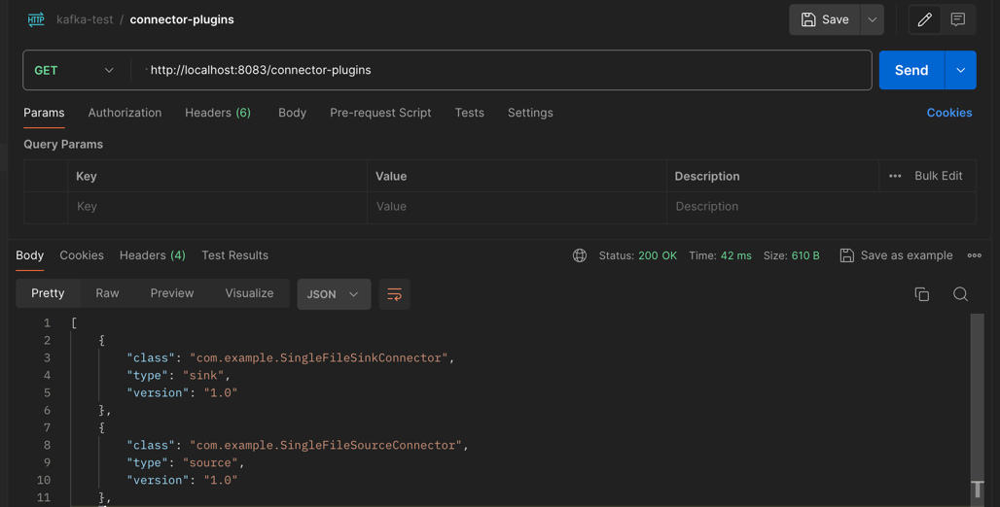
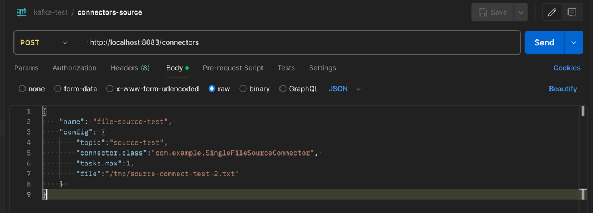

# 커스텀 소스 커넥터

### 코드 분석

1. SingleFileSourceConnectorConfig.java

    ```java
    /**
     * connector 등록 시 default 값 지정
     * 해당 설정 값은 Task 에서 사용 된다.
     */
    public class SingleFileSourceConnectorConfig extends AbstractConfig {
    
        public static final String DIR_FILE_NAME = "file";
        private static final String DIR_FILE_NAME_DEFAULT_VALUE = "/tmp/kafka.txt";
        private static final String DIR_FILE_NAME_DOC = "읽을 파일 경로와 이름";
    
        public static final String TOPIC_NAME = "topic";
        private static final String TOPIC_DEFAULT_VALUE = "test";
        private static final String TOPIC_DOC = "보낼 토픽명";
    
        public static ConfigDef CONFIG = new ConfigDef().define(DIR_FILE_NAME,
                                                        Type.STRING,
                                                        DIR_FILE_NAME_DEFAULT_VALUE,
                                                        Importance.HIGH,
                                                        DIR_FILE_NAME_DOC)
                                                        .define(TOPIC_NAME,
                                                                Type.STRING,
                                                                TOPIC_DEFAULT_VALUE,
                                                                Importance.HIGH,
                                                                TOPIC_DOC);
    
        public SingleFileSourceConnectorConfig(Map<String, String> props) {
            super(CONFIG, props);
        }
    }
    ```

2. SingleFileSourceConnector.java

    ```java
    /**
     * 1. connector 등록 시 수행되는 start 메서드 정의
     *    - REST-API 를 통해 받은 설정 값으로 커스텀 커넥터 설정 값 오버라이드  
     * 2. connector 등록 시 수행되는 task 클래스 정의
     *    - SingleFileSourceTask.java 로 지정함
     * 3. connector 등록 시 task 설정 값 지정
     *    - 현재는 모든 task 에 동일한 설정 값 반영
     */
    public class SingleFileSourceConnector extends SourceConnector {
    
        private final Logger logger = LoggerFactory.getLogger(SingleFileSourceConnector.class);
    
        private Map<String, String> configProperties;
    
        @Override
        public String version() {
            return "1.0";
        }
    
        @Override
        public void start(Map<String, String> props) {
            this.configProperties = props;
            try {
                new SingleFileSourceConnectorConfig(props);
            } catch (ConfigException e) {
                throw new ConnectException(e.getMessage(), e);
            }
        }
    
        @Override
        public Class<? extends Task> taskClass() {
            return SingleFileSourceTask.class;
        }
    
        @Override
        public List<Map<String, String>> taskConfigs(int maxTasks) {
            List<Map<String, String>> taskConfigs = new ArrayList<>();
            Map<String, String> taskProps = new HashMap<>();
            taskProps.putAll(configProperties);
            for (int i = 0; i < maxTasks; i++) {
                taskConfigs.add(taskProps);
            }
            return taskConfigs;
        }
    
        @Override
        public ConfigDef config() {
            return SingleFileSourceConnectorConfig.CONFIG;
        }
    
        @Override
        public void stop() {
        }
    }
    ```

3. SingleFileSourceTask.java

    ```java
    /**
     * 1. 실제 데이터 처리가 수행되는 클래스
     * 2. connector 기동 시 수행 되는 start 메서드 정의
     *    - connector 등록 시 설정 된 토픽명, 파일명 세팅
     *    - 해당 파일명을 기준으로 offset 관리
     * 3. topic에 전달하는 poll 메서드 정의
     *    - 1초 간격으로 수행
     *    - 파일명을 기준으로 마지막 offset으로 부터 파일을 읽어 List<SourceRecord> 단위로 topic에 전달 
     */
    public class SingleFileSourceTask extends SourceTask {
        private Logger logger = LoggerFactory.getLogger(SingleFileSourceTask.class);
    
        public final String FILENAME_FIELD = "filename";
        public final String POSITION_FIELD = "position";
    
        private Map<String, String> fileNamePartition;
        private Map<String, Object> offset;
        private String topic;
        private String file;
        private long position = -1;
    
    
        @Override
        public String version() {
            return "1.0";
        }
    
        @Override
        public void start(Map<String, String> props) {
            try {
                // Init variables
                SingleFileSourceConnectorConfig config = new SingleFileSourceConnectorConfig(props);
                topic = config.getString(SingleFileSourceConnectorConfig.TOPIC_NAME);
                file = config.getString(SingleFileSourceConnectorConfig.DIR_FILE_NAME);
                fileNamePartition = Collections.singletonMap(FILENAME_FIELD, file);
                offset = context.offsetStorageReader().offset(fileNamePartition);
    
                // Get file offset from offsetStorageReader
                if (offset != null) {
                    Object lastReadFileOffset = offset.get(POSITION_FIELD);
                    if (lastReadFileOffset != null) {
                        position = (Long) lastReadFileOffset;
                    }
                } else {
                    position = 0;
                }
    
            } catch (Exception e) {
                throw new ConnectException(e.getMessage(), e);
            }
        }
    
        @Override
        public List<SourceRecord> poll() {
            List<SourceRecord> results = new ArrayList<>();
            try {
                Thread.sleep(1000);
    
                List<String> lines = getLines(position);
    
                if (lines.size() > 0) {
                    lines.forEach(line -> {
                        Map<String, Long> sourceOffset = Collections.singletonMap(POSITION_FIELD, ++position);
                        SourceRecord sourceRecord = new SourceRecord(fileNamePartition, sourceOffset, topic, Schema.STRING_SCHEMA, line);
                        results.add(sourceRecord);
                    });
                }
                return results;
            } catch (Exception e) {
                logger.error(e.getMessage(), e);
                throw new ConnectException(e.getMessage(), e);
            }
        }
    
        private List<String> getLines(long readLine) throws Exception {
            BufferedReader reader = Files.newBufferedReader(Paths.get(file));
            return reader.lines().skip(readLine).collect(Collectors.toList());
        }
    
        @Override
        public void stop() {
        }
    }
    ```
   
4. build.gradle
    ```groovy
    plugins {
        id 'java'
        id 'com.github.johnrengelman.shadow' version '8.1.1'
    }
    
    group 'com.example'
    version '1.0'
    
    repositories {
        mavenCentral()
    }
    
    dependencies {
        implementation 'org.apache.kafka:connect-api:2.5.0'
        implementation 'org.slf4j:slf4j-simple:1.7.30'
    }
    
    tasks.named('shadowJar') {
        archiveBaseName.set('simple-source-connector-jar')
        archiveVersion.set('1.0.0')
        archiveClassifier.set('')
    }
    
    ```
   
- fat jar 를 만들기 위해 com.github.johnrengelman.shadow 오픈소스 플러그인 사용
    ```shell
     # build/libs/simple-source-connector-jar-1.1.0.jar 파일 생성
     ./gradlew shadowJar
    ```
   
***
### 커스텀 소스 커넥터 기동 테스트

1. connect-distributed.properties
    - plugin.path 지정
      - plugin.path=${KAFKA_HOME}/connector-jar
      - 지정된 plugin.path에 simple-source-connector-jar-1.1.0.jar 파일 위치
    - key.converter, value.converter 변경
      - JsonConverter > StringConverter

    ```properties
    bootstrap.servers=my-kafka:9092
    group.id=connect-cluster
    #key.converter=org.apache.kafka.connect.json.JsonConverter
    #value.converter=org.apache.kafka.connect.json.JsonConverter
    key.converter=org.apache.kafka.connect.storage.StringConverter
    value.converter=org.apache.kafka.connect.storage.StringConverter
    
    key.converter.schemas.enable=true
    value.converter.schemas.enable=true
    
    plugin.path=/Users/kj/Desktop/kafka/kafka_2.13-3.7.0/connector-jar
    ```

2. connect-distributed(분산 모드 커넥트) 실행

    ```shell
    $ bin/connect-distributed.sh config/connect-distributed.properties
    ```
   
3. 커넥트 > REST-API : 사용 가능한 플러그인 조회
   <br><br>
    
    
    ```http request
    GET  http://localhost:8083/connector-plugins
    ```
   
4. 커넥트 > REST-API : 커넥터 등록
   <br><br>
    
    
    ```http request
    POST  http://localhost:8083/connectors
    BODY
    {
        "name": "file-source-test",   # 커넥터 프로세스명 : unique
        "config": {
            "topic":"source-test",    # 커스텀 커넥터에서 파일을 읽고 전송할 topic 명
            "connector.class":"com.example.SingleFileSourceConnector", # 사용될 커스텀 커넥터 클래스 정보 
            "tasks.max":1,            # task 개수 
            "file":"/tmp/source-connect-test-2.txt"  # 커스텀 커넥터에서 읽을 파일 경로 
        } 
    }
    ```

5. /tmp/source-connect-test-2.txt >> source-test 토픽 전달 확인
   <br><br>
    
    ```shell
    $ bin/kafka-console-consumer.sh --bootstrap-server my-kafka:9092 --topic source-test --from-beginning
    ```

   source-connect-test-2.txt 파일에 텍스트를 추가하면, 1초에 1번 소스 커넥터가 poll 처리 해서 source-test 토픽으로 전송 한다.