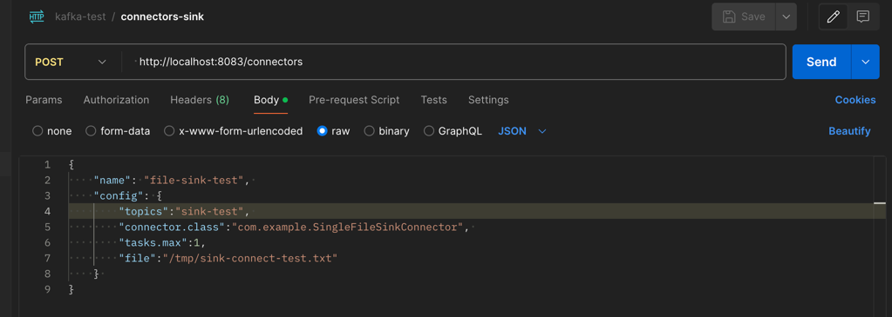

# 커스텀 싱크 커넥터

### 코드분석

1. SingleFileSinkConnectorConfig.java

    ```java
    /**
     * connector 등록 시 default 값 지정
     * 해당 설정 값은 Task 에서 사용 된다.
     */
    public class SingleFileSinkConnectorConfig extends AbstractConfig {
    
        public static final String DIR_FILE_NAME = "file";
        private static final String DIR_FILE_NAME_DEFAULT_VALUE = "/tmp/kafka.txt";
        private static final String DIR_FILE_NAME_DOC = "저장할 디렉토리와 파일 이름";
    
        public static ConfigDef CONFIG = new ConfigDef().define(DIR_FILE_NAME,
                                                        Type.STRING,
                                                        DIR_FILE_NAME_DEFAULT_VALUE,
                                                        Importance.HIGH,
                                                        DIR_FILE_NAME_DOC);
    
        public SingleFileSinkConnectorConfig(Map<String, String> props) {
            super(CONFIG, props);
        }
    }
    ```
   
2. SingleFileSinkConnector.java

    ```java
    /**
     * 1. connector 등록 시 수행되는 start 메서드 정의
     *    - REST-API 를 통해 받은 설정 값으로 커스텀 커넥터 설정 값 오버라이드  
     * 2. connector 등록 시 수행되는 task 클래스 정의
     *    - SingleFileSinkTask.java 로 지정함
     * 3. connector 등록 시 task 설정 값 지정
     *    - 현재는 모든 task 에 동일한 설정 값 반영
     */
    public class SingleFileSinkConnector extends SinkConnector {
    
        private Map<String, String> configProperties;
    
        @Override
        public String version() {
            return "1.0";
        }
    
        @Override
        public void start(Map<String, String> props) {
            this.configProperties = props;
            try {
                new SingleFileSinkConnectorConfig(props);
            } catch (ConfigException e) {
                throw new ConnectException(e.getMessage(), e);
            }
        }
    
        @Override
        public Class<? extends Task> taskClass() {
            return SingleFileSinkTask.class;
        }
    
        @Override
        public List<Map<String, String>> taskConfigs(int maxTasks) {
            List<Map<String, String>> taskConfigs = new ArrayList<>();
            Map<String, String> taskProps = new HashMap<>();
            taskProps.putAll(configProperties);
            for (int i = 0; i < maxTasks; i++) {
                taskConfigs.add(taskProps);
            }
            return taskConfigs;
        }
    
        @Override
        public ConfigDef config() {
            return SingleFileSinkConnectorConfig.CONFIG;
        }
    
        @Override
        public void stop() {
        }
    }
    ```
   
3. SingleFileSinkTask.java

    ```java
    /**
     * 1. 실제 데이터 처리가 수행되는 클래스
     * 2. connector 기동 시 수행 되는 start 메서드 정의
     *    - connector 등록 시 설정 된 파일명으로 파일 쓰기 설정
     * 3. topic을 수신하고 설정된 파일을 쓰는 put 메서드 정의
     *    - SinkRecord 단위로 파일 write
     * 4. offset flush 메서드 정의 
     *    - fileWriter.flush 수행 > fileWriter 메모리 비우기 
     * 5. 커넥터 중지 시 stop 메서드 정의
     *    - fileWriter.close 수행 > fileWriter 자원 반환
     */
    public class SingleFileSinkTask extends SinkTask {
        private SingleFileSinkConnectorConfig config;
        private File file;
        private FileWriter fileWriter;
    
        @Override
        public String version() {
            return "1.0";
        }
    
        @Override
        public void start(Map<String, String> props) {
            try {
                config = new SingleFileSinkConnectorConfig(props);
                file = new File(config.getString(config.DIR_FILE_NAME));
                fileWriter = new FileWriter(file, true);
            } catch (Exception e) {
                throw new ConnectException(e.getMessage(), e);
            }
    
        }
    
        @Override
        public void put(Collection<SinkRecord> records) {
            try {
                for (SinkRecord record : records) {
                    fileWriter.write(record.value().toString() + "\n");
                }
            } catch (IOException e) {
                throw new ConnectException(e.getMessage(), e);
            }
        }
    
        @Override
        public void flush(Map<TopicPartition, OffsetAndMetadata> offsets) {
            try {
                fileWriter.flush();
            } catch (IOException e) {
                throw new ConnectException(e.getMessage(), e);
            }
        }
    
        @Override
        public void stop() {
            try {
                fileWriter.close();
            } catch (IOException e) {
                throw new ConnectException(e.getMessage(), e);
            }
        }
    }
    ```

4. build.gradle

    ```groovy
    plugins {
        id 'java'
        id 'com.github.johnrengelman.shadow' version '8.1.1'
    }
    
    group 'com.example'
    version '1.0'
    
    repositories {
        mavenCentral()
    }
    
    dependencies {
        implementation 'org.apache.kafka:connect-api:2.5.0'
        implementation 'org.slf4j:slf4j-simple:1.7.30'
    }
    
    tasks.named('shadowJar') {
        archiveBaseName.set('simple-sink-connector-jar')
        archiveVersion.set('1.0.0')
        archiveClassifier.set('')
    }
    
    ```
    
- fat jar 를 만들기 위해 com.github.johnrengelman.shadow 오픈소스 플러그인 사용
    ```shell
     # build/libs/simple-sink-connector-jar-1.1.0.jar 파일 생성
     ./gradlew shadowJar
    ```

***
### 커스텀 싱크 커넥터 기동 테스트

1. connect-distributed.properties
    - plugin.path 지정
        - plugin.path=${KAFKA_HOME}/connector-jar
        - 지정된 plugin.path에 simple-sink-connector-jar-1.1.0.jar 파일 위치
    - key.converter, value.converter 변경
        - JsonConverter > StringConverter

    ```properties
    bootstrap.servers=my-kafka:9092
    group.id=connect-cluster
    #key.converter=org.apache.kafka.connect.json.JsonConverter
    #value.converter=org.apache.kafka.connect.json.JsonConverter
    key.converter=org.apache.kafka.connect.storage.StringConverter
    value.converter=org.apache.kafka.connect.storage.StringConverter
    
    key.converter.schemas.enable=true
    value.converter.schemas.enable=true
    
    plugin.path=/Users/kj/Desktop/kafka/kafka_2.13-3.7.0/connector-jar
    ```

2. connect-distributed(분산 모드 커넥트) 실행

    ```shell
    $ bin/connect-distributed.sh config/connect-distributed.properties
    ```

3. 커넥트 > REST-API : 사용 가능한 플러그인 조회
   <br><br>
   

    ```http request
    GET  http://localhost:8083/connector-plugins
    ```

4. 커넥트 > REST-API : 커넥터 등록
   <br><br>
    

    ```http request
    POST  http://localhost:8083/connectors
    BODY
    {
        "name": "file-sink-test",    # 커넥터 프로세스명 : unique
        "config": {
            "topics":"sink-test",    # 커스텀 커넥터에서 topic을 읽을 대상
            "connector.class":"com.example.SingleFileSinkConnector",  # 사용될 커스텀 커넥터 클래스 정보 
            "tasks.max":1,           # task 개수 
            "file":"/tmp/sink-connect-test.txt"  # 커스텀 커넥터에서 쓸 파일 경로 
        } 
    }
    ```

5. sink-test 토픽 >> sink-connect-test.txt 파일 확인
    <br><br>
   
    ```shell
    $ bin/kafka-console-producer.sh --bootstrap-server my-kafka:9092 --topic sink-test
    >hi
    >hello
    >sink-connect-test!!
    >welcome custom sink connector!
    >add-data!
    ```

   sink-test 토픽에 메세지를 전송하면, connect-distributed.properties > offset.flush.interval.ms 에 설정된 10초 간격으로 sink-connect-test.txt 파일이 쓰여진다.

