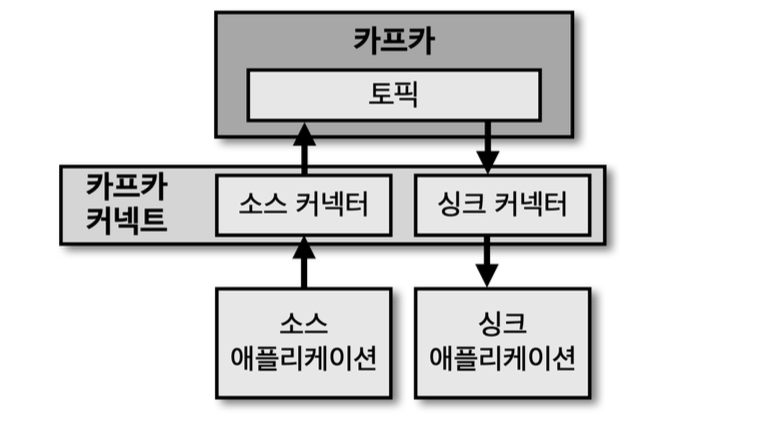

# 카프카 커넥트



- 카프카 커넥트는 데이터 파이프라인 생성 시 반복 작업을 줄이고 효율적인 전송을 위한 어플리케이션이다.
- 카프카 커넥트는 특정한 작업 형태를 "템플릿"으로 만들어 놓은 "커넥터"를 실행함으로써 반복 작업을 줄일 수 있다.

***
### 카프카 내부구조


- 사용자가 커넥트에 REST-API 를 통해 커넥터 생성 명령을 내리면 커넥트는 내부에 커넥터와 태스크를 생성한다.
- 커넥터는 태스크들을 관리한다.
- 태스크는 커넥터에 종속되는 개념으로 실질적인 데이터 관리를 한다.
- **태스크 최적의 개수는 토픽의 파티션 개수로 설정**하는 것이다.

***
### 소스 커넥터, 싱크 커넥터

- 프로듀서 역할을 하는 "소스 커넥터" 와 컨슈머 역할을 하는 "싱크 커넥터" 가 존재한다.
- 예를 들어 "파일 소스 커넥터"가 있다고 하면, 파일 소스 커넥터는 파일을 읽어서 토픽에 전송한다.
- 예를 들어 "파일 싱크 커넥터"가 있다고 하면, 파일 싱크 커넥터는 토픽을 읽어서 파일에 저장한다.
- MySQL, AWS S3, MongoDB 등 은 대표적인 싱크 어플리케이션, 소스 어플리케이션 이라고 할 수 있다.
- 싱크/소스 어플리케이션 인 MySQL 에서 카프카로 데이터를 송/수신 할 때 JDBC 오픈소스 커넥터를 활용해서 파이프라인을 생성할 수 있다.

***
### 커넥터 플러그인


- 카프카 기본 플러그인 커넥터로 파일 싱크/소스 커넥터가 제공된다.
- 그 외의 플러그인 커넥터를 추가하려면, 오픈소스 커넥터 jar 파일이나, 직접 개발한 커넥터 jar 파일을 카프카 커넥트에 설정해서 사용할 수 있다.

***
### 오픈소스 커넥터

- 오픈소스 커넥터는 직접 커넥터를 만들 필요 없이 커넥터 jar 파일을 다운 받아 사용할 수 있다.
- HDFS, AWS S3, JDBC, 엘라스틱 서치 등 100개가 넘는 커넥터가 오픈소스 커넥터로 제공되고 있다.
- 오픈소스 커넥터의 종류는 [컨플루언트 허브](https://www.confluent.io/hub) 에서 검색 할 수 있다.

***
### 컨버터, 트랜스폼

- 사용자가 커넥터를 사용하여 파이프라인을 생성할 때 컨버터와 트랜스폼 기능을 추가할 수 있다.
- 컨버터는 데이터 처리를 하기 전에 스키마를 변경하도록 도와준다.
- JsonConverter, StringConverter, ByteArrayConverter 를 기본 제공 하고, 필요하면 커스텀 컨버터를 작성할 수 있다.
- 트랜스폼은 데이터 처리 시 각 메시지 단위로 데이터를 간단하게 변환하기 위해 사용 된다.
- 예를 들어 JSON 데이터를 커넥터에서 사용할 때 트랜스폼을 사용하면 특정 키를 삭제하거나 추가할 수 있다.
- Cast, Drop, ExtractField 등을 기본 제공 한다.

***
### 커넥트 실행 방법

- 단일 모드 커넥트 / 분산 모드 커넥트 로 실행 가능하다.
- 단일 모드 커넥트는 1개의 프로세스로 실행 되고 분산 모드 커넥트는 멀티 프로세스로 실행 된다.

***
### 단일 모드 커넥트


- 단일 모드 커넥트는 1개의 프로세스로 실행된다.
- 장애 발생 시 장애 복구 시스템이 구축 되지 않아 중요도가 낮은 파이프라인을 운영할 때 사용 한다.

***
### 분산 모드 커넥트


- 분산 모드 커넥트는 2대 이상의 서버에서 클러스터 형태로 운영해서 고가용성 장애 복구 시스템을 구성한다.
- 커넥트가 실행되는 서버 개수를 무중단으로 스케일 아웃하여 처리량을 늘릴 수 있다.
- 따라서 상용환경에서는 분산 모드 커넥트로 운영해야 한다.

***
### 커넥트 REST API 인터페이스


- REST API 를 사용해서 현재 실행중인 커넥트의 커넥터 플러그인 종류, 태스크 상태, 커넥터 상태 등을 조회 한다.
- 커넥트는 기본 8083 포트로 호출하며, HTTP 메서드 기반 API 를 제공한다.

***
### 단일 모드 커넥트 설정

- 단일모드 커넥트를 실행하기 위해서는 단일 모드 커넥트 설정 파일을 수정한다.
- connect-standalone.properties

    ```properties
    bootstrap.servers=my-kafka:9092                                     # kafka 클러스터 호스트:포트
    key.converter=org.apache.kafka.connect.json.JsonConverter           # converter 설정
    value.converter=org.apache.kafka.connect.json.JsonConverter         # converter 설정
    key.converter.schemas.enable=false                                  # converter 사용여부
    value.converter.schemas.enable=false                                # converter 사용여부
    offset.storage.file.filename=/tmp/connect.offsets                   # offset 인덱스 정보 저장 파일 로컬 서버 경로
    offset.flush.interval.ms=10000                                      # 태스크가 처리 완료한 오프셋을 커밋하는 주기
    plugin.path=/usr/local/share/java,/usr/local/share/kafka/plugins    # 플러그인 커넥터의 jar파일이 위치하는 디렉토리 경로
    ```

***
### 단일 모드 커넥트 실행

- 커넥트 설정 파일(connect-standalone.properties) 과 커넥터 설정파일(connect-file-source.properties) 을 차례로 입력해서 실행
- connect-file-source.properties (ex : 파일 소스 커넥터 설정 파일)

    ```properties
    name=local-file-source                      # 커넥터 이름
    connector.class=FileStreamSource            # 사용할 커넥터 클래스
    tasks.max=1                                 # 커넥터 task 개수
    file=/tmp/test.txt                          # 토픽 전송 시, 읽을 파일 위치
    topic=connect-test                          # 전송 대상 토픽
    ```
  
***
### 분산 모드 커넥트


- 분산 모드는 2개 이상의 프로세스가 1개의 그룹으로 묶여서 운영된다.
- 따라서 1개의 프로세스에 이슈가 발생하더라도 나머지 1개 프로세스에서 처리 가능하다.
- connect-distributed.properties
  ```properties
  bootstrap.servers=my-kafka:9092                                     # kafka 클러스터 호스트:포트
  group.id=connect-cluster                                            # 분산 모드 group.id
  key.converter=org.apache.kafka.connect.json.JsonConverter           # converter 설정
  value.converter=org.apache.kafka.connect.json.JsonConverter         # converter 설정
  key.converter.schemas.enable=false                                  # converter 사용여부
  value.converter.schemas.enable=false                                # converter 사용여부
  
  offset.storage.topic=connect-offsets                                # 오프셋 정보 저장하는 카프카 토픽
  offset.storage.replication.factor=1                                 # 오프카 정보 저장하는 카프카 토픽 복제 개수 (운영 환경 에서는 3 이상이 좋음)
  config.storage.topic=connect-configs                                # 커넥터 설정 정보 저장하는 카프카 토픽
  config.storage.replication.factor=1                                 # 커넥터 설정 정보 저장하는 카프카 토픽 복제 개수 (3 추천)
  status.storage.topic=connect-status                                 # 커넥터 상태 정보 저장하는 카프카 토픽
  status.storage.replication.factor=1                                 # 커넥터 상태 정보 저장하는 카프카 토픽 복제 개수 (3 추천)
  
  offset.flush.interval.ms=10000                                      # 태스크가 처리 완료한 오프셋을 커밋하는 주기
  plugin.path=/usr/local/share/java,/usr/local/share/kafka/plugins    # 플러그인 커넥터의 jar파일이 위치하는 디렉토리 경로
  ```
  
***
### 커스텀 소스 커넥터


- 소스 커넥터는 소스 어플리케이션 또는 소스 파일로부터 데이터를 가져와 토픽에 저장하는 역할
- 직접 커스텀 소스 커넥터를 개발하려면 카프카 커넥트 라이브러리에서 제공하는 SourceConnetor 와 SourceTask 를 사용해서 직접 구현 가능하다.
- 직접 구현한 소스 커넥터를 빌드하여 jar 파일로 만들고 커넥트 실행 시 플러그인으로 추가 해서 사용할 수 있다.

***
### SourceConnector

- 태스크를 실행하기 전 커넥터 설정파일을 초기화
- 어떤 클래스를 사용할 것인지 정의
- 실질적인 데이터 처리는 하지 않음

***
### SourceTask

- 소스 어플리케이션 또는 소스 파일로부터 데이터를 가져와서 토픽으로 저장하는 역할
- 토픽에서 사용하는 오프셋이 아닌 자체 오프셋 사용
- 실질적인 데이터 처리 담당