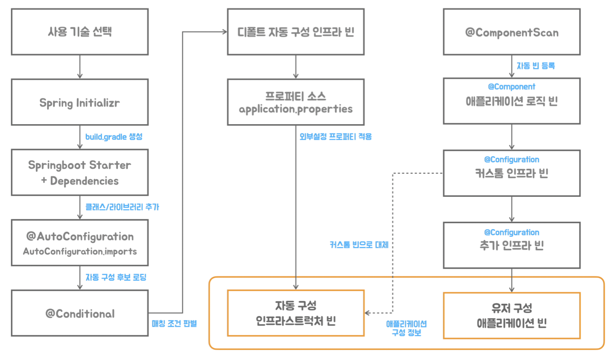
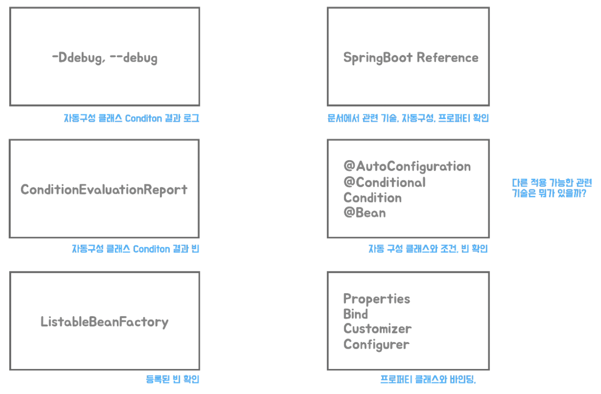

# 10 스프링 부트 자세히 보기



스프링 부트의 동작방식을 이해하고 자신이 사용하는 기술 관련 자동구성과 프로퍼티 등을 분석하고 어떻게 활용할 수 있는지 파악하는 것이 필요하다.

### 자동구성 분석방법



1. -Ddebug VM 옵션 추가

2. ConditionEvaluationReport 타입 빈을 주입 받아 원하는 정보만 선택 해서 자둥구성 정보 출력

```java
@SpringBootApplication
public class TobySpringbootAutoconfigApplication {

  @Bean
  public ApplicationRunner run(ConditionEvaluationReport report) {
    return args -> {
      System.out.println(report.getConditionAndOutcomesBySource().entrySet().stream()
          .filter(co -> co.getValue().isFullMatch())
          .filter(co -> co.getKey().indexOf("Jmx") < 0)
          .map(co -> {
            System.out.println(co.getKey());
            co.getValue().forEach(c -> {
              System.out.println("\t" + c.getOutcome());
            });
            System.out.println();
            return co;
          }).count());
    };
  }

  public static void main(String[] args) {
    SpringApplication.run(TobySpringbootAutoconfigApplication.class, args);
  }
}
```

3. ListableBeanFactory 타입 빈을 주입 받아서 최종적으로 등록된 빈 목록 조회

4. 자동구성 결과를 기준으로 스프링 부트 레퍼런스 문서 참고하기.

5. 자동 구성 클래스의 코드, 프로퍼티 클래스, 커스터마이저 등을 차근차근 따라가보기

### Core 자동구성 살펴보기

@ConditionalOnProperty 조건인 경우 matchIfMissing = true 라면 프로퍼티가 존재하지 않아도 조건이 매칭된다.

```java
@AutoConfiguration
@ConditionalOnProperty(prefix = "spring.aop", name = "auto", havingValue = "true", matchIfMissing = true)
public class AopAutoConfiguration {

}
```

### Web 자동구성 살펴보기

##### HttpMessageConvertersAutoConfiguration

Spring MVC 에서 Object를 Json으로 변환해주는 MappingJackson2HttpMessageConverter 는 아래의 AutoConfiguration 로직으로
설정된다.

```java
/**
 * @AutoConfiguration(after = ...) : 해당 Configuration 처리 이후에 동작하도록 설정
 * @Import : @Conditional 조건이 참이 됬을 때 외부 @Import 설정 처리
 */
@AutoConfiguration(
    after = {GsonAutoConfiguration.class, JacksonAutoConfiguration.class,
        JsonbAutoConfiguration.class})
@ConditionalOnClass(HttpMessageConverter.class)
@Conditional(NotReactiveWebApplicationCondition.class)
@Import({JacksonHttpMessageConvertersConfiguration.class,       // 1. Import True
    GsonHttpMessageConvertersConfiguration.class,
    JsonbHttpMessageConvertersConfiguration.class})
@ImportRuntimeHints(HttpMessageConvertersAutoConfigurationRuntimeHints.class)
public class HttpMessageConvertersAutoConfiguration {

}
```

```java
/**
 * JacksonHttpMessageConvertersConfiguration
 * : MappingJackson2HttpMessageConverter 빈 등록
 */
@Configuration(proxyBeanMethods = false)
class JacksonHttpMessageConvertersConfiguration {

  @Configuration(proxyBeanMethods = false)
  @ConditionalOnClass(ObjectMapper.class)
  @ConditionalOnBean(ObjectMapper.class)
  @ConditionalOnProperty(name = HttpMessageConvertersAutoConfiguration.PREFERRED_MAPPER_PROPERTY,
      havingValue = "jackson", matchIfMissing = true)
  static class MappingJackson2HttpMessageConverterConfiguration {

    @Bean
    @ConditionalOnMissingBean(value = MappingJackson2HttpMessageConverter.class,
        ignoredType = {
            "org.springframework.hateoas.server.mvc.TypeConstrainedMappingJackson2HttpMessageConverter",
            "org.springframework.data.rest.webmvc.alps.AlpsJsonHttpMessageConverter"})
    MappingJackson2HttpMessageConverter mappingJackson2HttpMessageConverter(
        ObjectMapper objectMapper) {
      return new MappingJackson2HttpMessageConverter(objectMapper);
    }

  }
}
```

```java
/**
 * JacksonAutoConfiguration
 * : ObjectMapper 반 등록
 */
@AutoConfiguration
@ConditionalOnClass(ObjectMapper.class)
public class JacksonAutoConfiguration {

  @Configuration(proxyBeanMethods = false)
  @ConditionalOnClass(Jackson2ObjectMapperBuilder.class)
  static class JacksonObjectMapperConfiguration {

    @Bean
    @Primary
    @ConditionalOnMissingBean
    ObjectMapper jacksonObjectMapper(Jackson2ObjectMapperBuilder builder) {
      return builder.createXmlMapper(false).build();
    }

  }
}
```

##### RestClientAutoConfiguration

Customizer 빈을 이용하는 자동구성은 프로퍼티 빈을 Customizer가 주입 받고 이를 빈 오브젝트를 만드는 메서드에서 Customizer를 주입 받아서 프로퍼티 설정
로직을 적용하는 방식으로 동작하기도 한다.

```java
/**
 *  RestClientAutoConfiguration
 *    1. HttpMessageConvertersRestClientCustomizer default Bean 생성
 *    2. RestClientCustomizer 를 주입 받아 RestClientBuilderConfigurer default Bean 생성
 *    3. RestClientBuilderConfigurer 를 주입 받아 RestClient.Builder default 빈 생성
 *
 *  개발자가 HttpMessageConvertersRestClientCustomizer 커스텀 Bean을 등록하면 RestClient.Bulder에 자동 설정됨. 
 */
@AutoConfiguration(after = {HttpMessageConvertersAutoConfiguration.class,
    SslAutoConfiguration.class})
@ConditionalOnClass(RestClient.class)
@Conditional(NotReactiveWebApplicationCondition.class)
public class RestClientAutoConfiguration {

  @Bean
  @ConditionalOnMissingBean
  @Order(Ordered.LOWEST_PRECEDENCE)
  HttpMessageConvertersRestClientCustomizer httpMessageConvertersRestClientCustomizer(
      ObjectProvider<HttpMessageConverters> messageConverters) {
    return new HttpMessageConvertersRestClientCustomizer(messageConverters.getIfUnique());
  }

  @Bean
  @ConditionalOnMissingBean(RestClientSsl.class)
  @ConditionalOnBean(SslBundles.class)
  AutoConfiguredRestClientSsl restClientSsl(SslBundles sslBundles) {
    return new AutoConfiguredRestClientSsl(sslBundles);
  }

  @Bean
  @ConditionalOnMissingBean
  RestClientBuilderConfigurer restClientBuilderConfigurer(
      ObjectProvider<RestClientCustomizer> customizerProvider) {
    RestClientBuilderConfigurer configurer = new RestClientBuilderConfigurer();
    configurer.setRestClientCustomizers(customizerProvider.orderedStream().toList());
    return configurer;
  }

  @Bean
  @Scope("prototype")
  @ConditionalOnMissingBean
  RestClient.Builder restClientBuilder(RestClientBuilderConfigurer restClientBuilderConfigurer) {
    RestClient.Builder builder = RestClient.builder()
        .requestFactory(ClientHttpRequestFactories.get(ClientHttpRequestFactorySettings.DEFAULTS));
    return restClientBuilderConfigurer.configure(builder);
  }
}
```

최종 빈 오브젝트를 만드는 Builder를 빈으로 등록하는 경우도 있다.   
이 빌더 빈을 어플리케이션에서 가져다 사용해서 빈 오브젝트를 직접 구성하는 것도 가능하다.   
RestTemplateBuilder 처럼 빌더만 자동구성으로 제공하는 경우도 있다.

```java
@AutoConfiguration(after = HttpMessageConvertersAutoConfiguration.class)
@ConditionalOnClass(RestTemplate.class)
@Conditional(NotReactiveWebApplicationCondition.class)
public class RestTemplateAutoConfiguration {

  @Bean
  @Lazy
  public RestTemplateBuilderConfigurer restTemplateBuilderConfigurer(
      ObjectProvider<HttpMessageConverters> messageConverters,
      ObjectProvider<RestTemplateCustomizer> restTemplateCustomizers,
      ObjectProvider<RestTemplateRequestCustomizer<?>> restTemplateRequestCustomizers) {
    RestTemplateBuilderConfigurer configurer = new RestTemplateBuilderConfigurer();
    configurer.setHttpMessageConverters(messageConverters.getIfUnique());
    configurer.setRestTemplateCustomizers(restTemplateCustomizers.orderedStream().toList());
    configurer.setRestTemplateRequestCustomizers(
        restTemplateRequestCustomizers.orderedStream().toList());
    return configurer;
  }

  @Bean
  @Lazy
  @ConditionalOnMissingBean
  public RestTemplateBuilder restTemplateBuilder(
      RestTemplateBuilderConfigurer restTemplateBuilderConfigurer) {
    RestTemplateBuilder builder = new RestTemplateBuilder();
    return restTemplateBuilderConfigurer.configure(builder);
  }
}
```

### Jdbc 자동구성 살펴보기

DataSource 자동구성에서 driver-class-name 프로퍼티를 넣지 않으면 url을 이용해서 드라이버와 클래스 이름을 넣어준다.   
내장형 DB를 사용하는 경우에 DataSource 프로퍼티가 없으면 스프링 부트가 자동으로 연결 정보를 설정해준다.

```java
@AutoConfiguration(before = SqlInitializationAutoConfiguration.class)
@ConditionalOnClass({DataSource.class, EmbeddedDatabaseType.class})
@ConditionalOnMissingBean(type = "io.r2dbc.spi.ConnectionFactory")
@EnableConfigurationProperties(DataSourceProperties.class)
@Import({DataSourcePoolMetadataProvidersConfiguration.class,
    DataSourceCheckpointRestoreConfiguration.class})
public class DataSourceAutoConfiguration {

  //DataSource Bean이 등록되어 있지 않으면 내장형 DB로 자동설정 해준다.
  @Configuration(proxyBeanMethods = false)
  @Conditional(EmbeddedDatabaseCondition.class)
  @ConditionalOnMissingBean({DataSource.class, XADataSource.class})
  @Import(EmbeddedDataSourceConfiguration.class)
  protected static class EmbeddedDatabaseConfiguration {

  }
}
```

```java
@ConfigurationProperties(prefix = "spring.datasource")
public class DataSourceProperties implements BeanClassLoaderAware, InitializingBean {

  //url을 이용해서 드라이버와 클래스 이름을 넣어준다.
  public String determineDriverClassName() {
    if (StringUtils.hasText(this.driverClassName)) {
      Assert.state(driverClassIsLoadable(),
          () -> "Cannot load driver class: " + this.driverClassName);
      return this.driverClassName;
    }
    String driverClassName = null;
    if (StringUtils.hasText(this.url)) {
      driverClassName = DatabaseDriver.fromJdbcUrl(this.url).getDriverClassName();
    }
    if (!StringUtils.hasText(driverClassName)) {
      driverClassName = this.embeddedDatabaseConnection.getDriverClassName();
    }
    if (!StringUtils.hasText(driverClassName)) {
      throw new DataSourceBeanCreationException("Failed to determine a suitable driver class", this,
          this.embeddedDatabaseConnection);
    }
    return driverClassName;
  }
}
```

TransactionProperties 는 PlatformTransactionManagerCustomizer를 구현한다.   
프로퍼티 클래스가 자신이 가진 값을 이용하는 간단한 Customizer 기능을 구현해서 사용되기도 한다.

```java
@ConditionalOnClass(PlatformTransactionManager.class)
@AutoConfiguration(before = TransactionAutoConfiguration.class)
@EnableConfigurationProperties(TransactionProperties.class)
public class TransactionManagerCustomizationAutoConfiguration {

  @Bean
  @ConditionalOnMissingBean
  TransactionManagerCustomizers platformTransactionManagerCustomizers(
      ObjectProvider<TransactionManagerCustomizer<?>> customizers) {
    return TransactionManagerCustomizers.of(customizers.orderedStream().toList());
  }

  @Bean
  ExecutionListenersTransactionManagerCustomizer transactionExecutionListeners(
      ObjectProvider<TransactionExecutionListener> listeners) {
    return new ExecutionListenersTransactionManagerCustomizer(listeners.orderedStream().toList());
  }
}
```

```java
/**
 * AbstractPlatformTransactionManager 를 TransactionProperties 가 직접 구현
 * Properties 값으로 Customizer 기능 구현 가능
 */
@ConfigurationProperties(prefix = "spring.transaction")
public class TransactionProperties implements
    TransactionManagerCustomizer<AbstractPlatformTransactionManager> {

  //
  @Override
  public void customize(AbstractPlatformTransactionManager transactionManager) {
    if (this.defaultTimeout != null) {
      transactionManager.setDefaultTimeout((int) this.defaultTimeout.getSeconds());
    }
    if (this.rollbackOnCommitFailure != null) {
      transactionManager.setRollbackOnCommitFailure(this.rollbackOnCommitFailure);
    }
  }
}
```

# 스프링 부트 더 알아가기

- 스프링 부트의 코어 (Profile, Logging, Testing)
- 핵심 기술 영역 (Web, Data, Messaging, IO)
- 운영환경의 모너터링, 관리 방법
- 컨테이너, 배포, 빌드 툴
- 스프링 부트 3.x
- 스프링 프레임워크와 자바 표준, 오픈소스 기술
