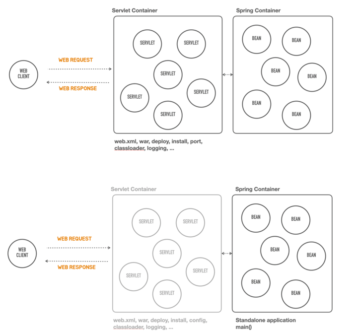

# 01 스프링 부트 살펴보기

◼︎ 스프링 부트 소개
스프링 부트는 스프링을 기반으로 실무환경에 사용가능한 수준의 독립실행형 애플리케이션을 복잡한 고민 없이 빠르게 작성할 수 있게 도와주는 여러가지 도구의 모음

> 스프링 != 스프링 부트

◼︎ 스프링 부트의 핵심목표

- 매우 빠르고 광범위한 영역의 스프링 개발 경험을 제공
- 강한 주장을 가지고 즉시 적용 가능한 기술 조합을 제공하면서, 필요에 따라 원하는 방식으로 손쉽게 변형 가능
- 프로젝트에서 필요로 하는 다양한 비기능적인 기술(내장형 서버, 보안, 메트릭, 상태체크, 외부설정방식 등) 제공
- 코드 생성이나 XML 설정을 필요로 하지 않음

◼︎ 컨테이너리스 개발

스프링 어플리케이션 개발에 요구되는 서블릿 컨테이너 설치, war 폴더 구조, web.xml 등과 같은 어플리케이션 개발의 핵심이 아닌 단순 반복 작업을 제거해주는 개발도구와
아키텍쳐를 지원   
설치된 컨테이너로 배포하지 않고 독립실행형(standalone) 자바 어플리케이션으로 동작