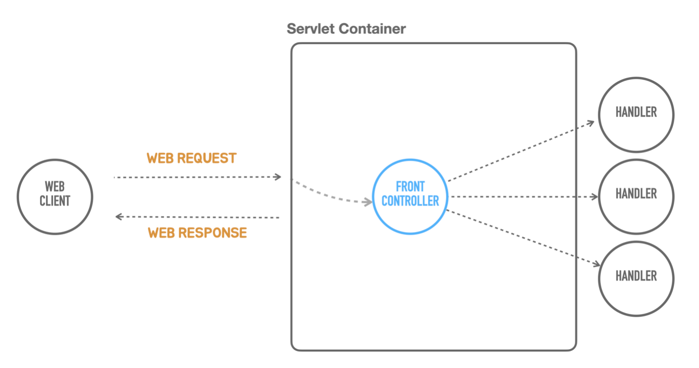

# 03 독립 실행형 서블릿 애플리케이션

◼︎ Containerless 개발 준비

- 스프링 부트 프로젝트 initializer에서 web 모듈을 선택하면 내장 톰캣 라이브러리가 추가된다.

내장형 톰캣의 초기화 작업과 간편한 설정을 지원하도록 스프링 부트가 제공하는 TomcatServletWebServerFactory 를 사용하면 톰캣 웹 서버를 실행하는 코드를 만들
수 있다.

```java
ServletWebServerFactory serverFactory = new TomcatServletWebServerFactory(); 
WebServer webServer = serverFactory.getWebServer();
webServer.start();
```

◼︎ 서블릿 등록

```java
public class TobySpringbootApplication {

  public static void main(String[] args) {
    ServletWebServerFactory serverFactory = new TomcatServletWebServerFactory();
    WebServer webServer = serverFactory.getWebServer(servletContext -> {
      servletContext.addServlet("hello", new HttpServlet() {
        @Override
        protected void service(HttpServletRequest req, HttpServletResponse resp)
            throws ServletException, IOException {
          resp.setStatus(HttpStatus.OK.value());
          resp.setHeader(HttpHeaders.CONTENT_TYPE, MediaType.TEXT_PLAIN_VALUE);
          resp.getWriter().println("Hello Servlet");
        }
      }).addMapping("/hello");
    });
    webServer.start();
  }
}

@FunctionalInterface
public interface ServletWebServerFactory extends WebServerFactory {

  WebServer getWebServer(ServletContextInitializer... initializers);
}

@FunctionalInterface
public interface ServletContextInitializer {

  void onStartup(ServletContext servletContext) throws ServletException;
}
```

◼︎ 프론트 컨트롤러



여러 요청을 처리하는데 반복적으로 등장하게 되는 공통 작업을 하나의 오브젝트에서 일괄적으로 처리하게 만드는 방식을 프론트 컨트롤러 패턴 이라고 한다.

```java
WebServer webServer = serverFactory.getWebServer(servletContext -> {
    HelloController helloController = new HelloController();
    
    servletContext.addServlet("frontcontroller", new HttpServlet() {
        @Override
        protected void service(HttpServletRequest req, HttpServletResponse resp) throws ServletException, IOException {
            // 인증, 보안, 다국어, 공통 기능
            if (req.getRequestURI().equals("/hello") && req.getMethod().equals(HttpMethod.GET.name())) {
                String name = req.getParameter("name");
    
                String ret = helloController.hello(name);

                resp.setStatus(HttpStatus.OK.value());
                resp.setHeader(HttpHeaders.CONTENT_TYPE, MediaType.TEXT_PLAIN_VALUE);
                resp.getWriter().println(ret);
            }
            else if (req.getRequestURI().equals("/user")) {
                //
            }
            else {
                resp.setStatus(HttpStatus.NOT_FOUND.value());
            }
        }
    }).addMapping("/*");    //모든 요청 처리
});
```
