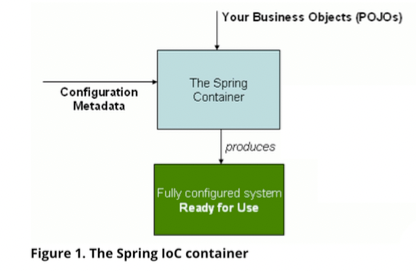
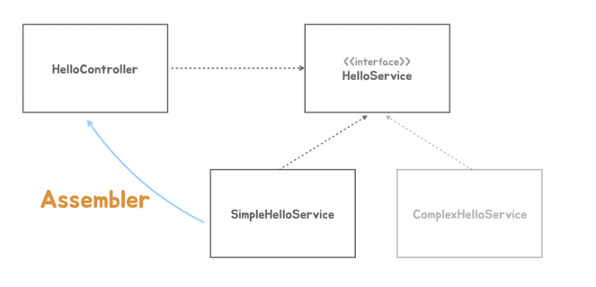
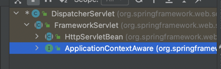

# 04 독립 실행형 스프링 애플리케이션

◼︎ 스프링 컨테이너 사용



스프링 컨테이너는 애플리케이션 로직이 담긴 평범한 자바 오브젝트, 일명 POJO와 구성 정보(Configuration Metadata)를 런타임에 조합해서 동작하는 최종
애플리케이션을 만들어낸다.

코드로 스프링 컨테이너를 만드는 가장 간단한 방법은 컨테이너를 대표하는 인터페이스인 ApplicationContext를 구현한 GenericApplicationContext를
이용하는 것이다.

```java
public class TobySpringbootApplication {

  public static void main(String[] args) {
    //GenericApplicationContext 사용해서 HelloController Bean 등록
    GenericApplicationContext applicationContext = new GenericApplicationContext();
    applicationContext.registerBean(HelloController.class);
    applicationContext.refresh();

    ServletWebServerFactory serverFactory = new TomcatServletWebServerFactory();
    WebServer webServer = serverFactory.getWebServer(servletContext -> {
      servletContext.addServlet("frontcontroller", new HttpServlet() {
        @Override
        protected void service(HttpServletRequest req, HttpServletResponse resp)
            throws ServletException, IOException {
          // 인증, 보안, 다국어, 공통 기능
          if (req.getRequestURI().equals("/hello") && req.getMethod()
              .equals(HttpMethod.GET.name())) {
            String name = req.getParameter("name");

            HelloController helloController = applicationContext.getBean(HelloController.class);
            String ret = helloController.hello(name);

            resp.setContentType(MediaType.TEXT_PLAIN_VALUE);
            resp.getWriter().println(ret);
          } else {
            resp.setStatus(HttpStatus.NOT_FOUND.value());
          }
        }
      }).addMapping("/*");
    });
    webServer.start();
  }
}
```

◼︎ Dependency Injection
스프링 컨테이너는 DI 컨테이너이다. 스프링은 DI를 적극적으로 활용해서 만들어져 있고, 스프링을 이용해서 애플리케이션을 개발할 때 DI를 손쉽게 적용할 수 있도록 지원해준다.

DI에는 2개의 오브젝트가 동적으로 의존관계를 가지는 것을 도와주는 제3의 존재가 필요하다. 이를 어셈블러 라고 한다.



스프링 컨테이너는 DI를 가능하게 해주는 어셈블러로 동작한다.

```java
public class HelloController {

  private final HelloService helloService;

  public HelloController(HelloService helloService) {
    this.helloService = helloService;
  }

  public String hello(String name) {
    return helloService.sayHello(Objects.requireNonNull(name));
  }
}

public class TobySpringbootApplication {

  public static void main(String[] args) {
    GenericApplicationContext applicationContext = new GenericApplicationContext();
    applicationContext.registerBean(HelloController.class);
    applicationContext.registerBean(SimpleHelloService.class);  //SimpleHelloService Bean 등록
    applicationContext.refresh();

    //.....중략
  }
}
```

스프링 컨테이너는 빈 오브젝트 사이의 의존관계를 여러 방법을 통해서 자동으로 파악한다.   
만약 빈 클래스(HelloService)가 단일 생성자를 가지고 있다면 생성자의 파라미터 타입의 빈 오브젝트가 있는지 확인하고   
있다면 이를 생성자 호출 시 주입해준다.

명시적으로 의존 오브젝트를 주입하는 정보를 컨테이너에게 제공하려면 @Autowired와 같은 애노테이션을 지정할 수 있다.

◼︎ DispatcherServlet으로 전환
스프링에는 앞에서 만들었던 프론트 컨트롤러와 같은 역할을 하는 DispatcherServlet이 있다.   
DispatcherServlet은 서블릿으로 동작하면서 스프링 컨테이너를 이용해서 요청을 전달할 핸들러인 컨트롤러 오브젝트를 가져와 사용한다.   
DispatcherServlet이 사용하는 스프링 컨테이너느 GenericWebApplicationContext를 이용해서 작성한다.

```java
public class TobySpringbootApplication {

  public static void main(String[] args) {
    GenericWebApplicationContext applicationContext = new GenericWebApplicationContext();
    applicationContext.registerBean(HelloController.class);
    applicationContext.registerBean(SimpleHelloService.class);
    applicationContext.refresh();

    ServletWebServerFactory serverFactory = new TomcatServletWebServerFactory();
    WebServer webServer = serverFactory.getWebServer(servletContext -> {
      servletContext.addServlet("dispatcherServlet",
              new DispatcherServlet(applicationContext))
          .addMapping("/*");
    });
    webServer.start();
  }
}
```

◼︎ 애노테이션 매핑 정보 사용

DispatcherServlet은 스프링 컨테이너에 등록된 빈 클래스에 있는 매핑 어노테이션 정보를 참고해서 웹 요청을 전달할 오브젝트와 메서드를 선정할 수 있다.

```java

@RequestMapping("/hello")
public class HelloController {

  private final HelloService helloService;

  public HelloController(HelloService helloService) {
    this.helloService = helloService;
  }

  @GetMapping
  @ResponseBody
  public String hello(String name) {
    return helloService.sayHello(Objects.requireNonNull(name));
  }
}
```

◼︎ 스프링 컨테이너로 통합

스프링 컨테이너의 초기화 작업 중에 호출되는 훅 메서드에 서블릿 컨테이너(톰캣)을 초기화하고 띄우는 코드를 넣는다.

```java
public class TobySpringbootApplication {

  public static void main(String[] args) {
    GenericWebApplicationContext applicationContext = new GenericWebApplicationContext() {  // 스프링 컨테이너 refresh 훅 메서드 톰캣 기동 코드 추가 재정의
      @Override
      protected void onRefresh() {
        super.onRefresh();

        ServletWebServerFactory serverFactory = new TomcatServletWebServerFactory();
        WebServer webServer = serverFactory.getWebServer(servletContext -> {
          servletContext.addServlet("dispatcherServlet",
                  new DispatcherServlet(this))
              .addMapping("/*");
        });
        webServer.start();
      }
    };
    applicationContext.registerBean(HelloController.class);
    applicationContext.registerBean(SimpleHelloService.class);
    applicationContext.refresh();
  }
}
```

◼ 자바 코드 구성정보 사용

- @Bean 팩토리 메서드를 사용하면 자바 코드를 이용해서 구성정보를 만들 수 있다.
- @Bean 메서드의 리턴 타입은 인터페이스로 지정하는 것이 좋다.
- 빈 오브젝트를 생성할 때 주입할 의존 오브젝트는 @Bean 메서드의 파라미터로 정의하면 스프링 컨테이너가 이를 전달해준다.
- @Bean 메서드가 있는 클래스는 @Configuration을 붙여줘야 한다.
- 자바 코드 구성정보를 사용하려면 AnnotationConfigWebApplicationContext 클래스로 컨테이너를 만들어야 한다.

```java

@Configuration
public class TobySpringbootApplication {

  @Bean
  public HelloController helloController(HelloService helloService) {
    return new HelloController(helloService);
  }

  @Bean
  public HelloService helloService() {
    return new SimpleHelloService();
  }

  public static void main(String[] args) {
    AnnotationConfigWebApplicationContext applicationContext = new AnnotationConfigWebApplicationContext() {
      @Override
      protected void onRefresh() {
        super.onRefresh();

        ServletWebServerFactory serverFactory = new TomcatServletWebServerFactory();
        WebServer webServer = serverFactory.getWebServer(servletContext -> {
          servletContext.addServlet("dispatcherServlet",
                  new DispatcherServlet(this))
              .addMapping("/*");
        });
        webServer.start();
      }
    };
    applicationContext.register(TobySpringbootApplication.class);
    applicationContext.refresh();
  }
}

```

◼︎ ComponentScan

애플리케이션의 메인 클래스에는 @ComponentScan 을 붙여준다.

```java

@Configuration
@ComponentScan
public class TobySpringbootApplication {

}
```

등록 대상이 될 클래스에는 @Component 애노테이션을 붙여준다.   
@Controller, @Service에는 @Coponent 애노테이션이 포함되어 있다.

```java

@RestController
public class HelloController {

}

@Service
public class SimpleHelloService implements HelloService {

}
```

◼︎ Bean의 생명주기 메서드

TomcatServletWebServerFactory 와 DispatcherServlet도 빈으로 등록해서 사용할 수 있다.   
@Bean 메서드에서 독립적으로 생성되는 경우 DispatcherServlet이 필요로 하는 WebApplicationContext 타입 컨테이너 오브젝트는 스프링 컨테이너의 빈
생명주기 메서드를 이용해서 주입 받게 된다.



```java
public interface ApplicationContextAware extends Aware {

  void setApplicationContext(ApplicationContext applicationContext) throws BeansException;

}
```

DispatcherServlet은 ApplicationContextAware 라는 스프링 컨테이너를 setter 메서드로 주입해주는 메서드를 가진 인터페이스를 구현해놨고, 이런
생애주기 빈 메서드를 가진 빈이 등록되면 스프링은 자신을 직접 주입해준다.

```java

@Configuration
@ComponentScan
public class TobySpringbootApplication {

  @Bean
  public ServletWebServerFactory servletWebServerFactory() {
    return new TomcatServletWebServerFactory();
  }

  @Bean
  public DispatcherServlet dispatcherServlet() {
    return new DispatcherServlet();
  }

  public static void main(String[] args) {
    AnnotationConfigWebApplicationContext applicationContext = new AnnotationConfigWebApplicationContext() {
      @Override
      protected void onRefresh() {
        super.onRefresh();

        ServletWebServerFactory serverFactory = this.getBean(ServletWebServerFactory.class);
        DispatcherServlet dispatcherServlet = this.getBean(DispatcherServlet.class);
        //dispatcherServlet.setApplicationContext(this); // 없어도 됨. 스프링 컨테이너 빈 생애주기 메서드가 직접 주입해준다.

        WebServer webServer = serverFactory.getWebServer(servletContext -> {
          servletContext.addServlet("dispatcherServlet", dispatcherServlet)
              .addMapping("/*");
        });
        webServer.start();
      }
    };
    applicationContext.register(TobySpringbootApplication.class);
    applicationContext.refresh();
  }
}
```

스프링이 제공하는 생명주기 메서드는 다음과 같은 것이 있다.

```
BeanNameAware's setBeanName
BeanClassLoaderAware's setBeanClassLoader
BeanFactoryAware's setBeanFactory
EnvironmentAware's setEnvironment
EmbeddedValueResolverAware's setEmbeddedValueResolver
ResourceLoaderAware's setResourceLoader (only applicable when running in an application context) ApplicationEventPublisherAware's setApplicationEventPublisher (only applicable when running in an application context) MessageSourceAware's setMessageSource (only applicable when running in an application context) ApplicationContextAware's setApplicationContext (only applicable when running in an application context) ServletContextAware's setServletContext (only applicable when running in a web application context) postProcessBeforeInitialization methods of BeanPostProcessors
InitializingBean's afterPropertiesSet
a custom init-method definition
postProcessAfterInitialization methods of BeanPostProcessors
```

빈 생명주기 메서드를 통해서 주입되는 오브젝트는 스프링 컨테이너가 스스로 빈으로 등록해서 빈으로 가져와 사용할 수도 있게 해준다.

◼︎ SpringApplication
지금까지 구현한 main() 코드를 MySpringApplication 클래스를 만들어 run 메서드로 넣어보면 SpringApplication.run과 유사한 형태로 만들어진다.
다른 점은 애노테이션 2개가 붙어있다는 것과 서블릿 컨테이너와 DispatcherServlet을 만드는 @Bean 메서드가 들어 있는 것이다.

```java

@Configuration
@ComponentScan
public class TobySpringbootApplication {

  @Bean
  public ServletWebServerFactory servletWebServerFactory() {
    return new TomcatServletWebServerFactory();
  }

  @Bean
  public DispatcherServlet dispatcherServlet() {
    return new DispatcherServlet();
  }

  public static void main(String[] args) {
    MySpringApplication.run(TobySpringbootApplication.class, args);
  }
}
```