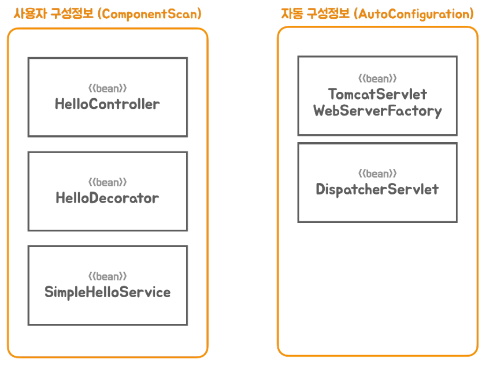
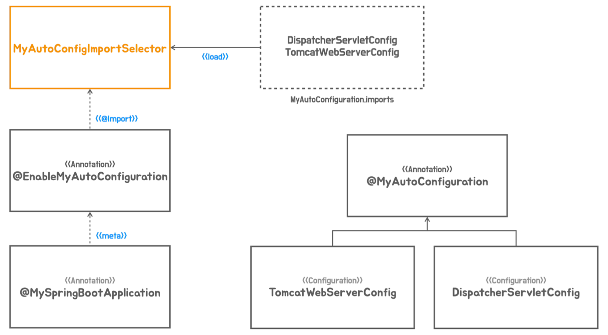

# 06 자동구성 기반 애플리케이션

◼︎ 메타 애노테이션과 합성 애노테이션

- Meta-annotation
-

```java

@Target(ElementType.TYPE)
@Retention(RetentionPolicy.RUNTIME)
@Documented
@Component            // Meta Annotation
public @interface Service {

  @AliasFor(annotation = Component.class)
  String value() default "";
}
```

애노테이션에 적용한 애노테이션을 메타 애노테이션이라고 한다.

- Composed-annotation

```java

@Target(ElementType.TYPE)
@Retention(RetentionPolicy.RUNTIME)
@Documented
@Controller
@ResponseBody
public @interface RestController {

  @AliasFor(annotation = Controller.class)
  String value() default "";

}
```

하나 이상의 메타 애노테이션이 적용된 애노테이션을 말한다.

◼︎ 빈 오브젝트의 역할과 구분

- 어플리케이션 로직 빈
  어플리케이션의 비즈니스 로직을 담고 있는 클래스로 만들어지는 빈.   
  컴포넌트 스캐너에 의해서 빈 구성정보가 생성되고 빈 오브젝트로 등록된다.

- 어플리케이션 인프라스트럭쳐 빈
  빈 구성정보에 의해 컨테이너에 등록되는 빈이지만 어플리케이션 로직이 아니라 어플리케이션에 동작하는데 꼭 필요한 기술 기반을 제공하는 빈이다.   
  전통적인 스프링 어플리케이션에서는 빈으로 등록되지 않지만 스프링 부트에서 구성정보에 의해 빈으로 등록 되어지는 ServletWebServerFactory나
  DispatcherServlet 등도 어플리케이션 인프라 빈이라고 볼 수 있다.

- 컨테이너 인프라스트럭쳐 빈
  스프링 컨테이너의 기능을 확장해서 빈의 등록돠 생성, 관계설정, 초기화 등의 작업에 참여하는 빈을 컨테이너 인프라스트럭처 빈, 컨테이너 인프라 빈 이라고 한다.   
  개발자가 작성한 구성 정보에 의해서 생성되는게 아니라 컨테이너가 직접 만들고 사용하는 빈이기 때문에 어플리케이션 빈과 구분한다.   
  필요한 경우 일부 컨테이너 인프라 빈은 주입 받아서 활용할 수 있다.


스프링 부트의 빈 구성정보는 컴포넌트 스캔에 의해서 등록되는 빈과 자동구성에 의해서 등록 되는 빈으로 구분된다.   
일반적으로 어플리케이션 인프라 빈은 자동 구성에 의해 등록되지만 개발자가 작성한 코드 구성정보에서도 등록될 수 있다.



◼︎ 인프라 빈 구성 정보의 분리
@Import 를 이용하면 스캔 대상이 아닌 클래스를 빈으로 등록하도록 추가할 수 있다.
보통 @Configuration 애노테이션이 붙은 클래스를 가져온다.   
@Component가 붙은 클래스도 빈으로 등록시킬 수 있다.   
애플리케이션 인프라스트럭쳐 빈 구성정보 클래스는 스프링 부트 자동 구성 메커니즘에 의해서 등록이 되도록 분리하는 작업이 필요하다.   
분리된 클래스는 @Import 로 포함시킨다.

```java

@Retention(RetentionPolicy.RUNTIME)
@Target(ElementType.TYPE)
@Import({DispatcherServletConfig.class, TomcatWebServerConfig.class}) // Meta-annotation
public @interface EnableMyAutoConfiguration {

}
```

```java
/**
 * main 메서드 클래스에 @MySpringBootApplication 추가
 */
@Retention(RetentionPolicy.RUNTIME)
@Target(ElementType.TYPE)
@Configuration
@ComponentScan
@EnableMyAutoConfiguration
public @interface MySpringBootApplication {

}
```

◼︎ 동적인 자동 구성 정보 등록

```java
public interface ImportSelector {

  String[] selectImports(AnnotationMetadata importingClassMetadata);
  //....중략
}
```

ImportSelector의 구현 클래스를 @Import 하면 selectImports 메서드가 리턴하는 클래스명으로   
@Configuration 클래스를 찾아서 구성 정보로 사용한다.

아래와 같이 코드에 의해서 @Import 대상을 외부에서 가져올 수 있는 동적인 방법을 제공한다.

```java
public class MyAutoConfigImportSelector implements DeferredImportSelector {

  @Override
  public String[] selectImports(AnnotationMetadata importingClassMetadata) {
    return new String[]{
        "com.example.config.autoconfig.DispatcherServletConfig",
        "com.example.config.autoconfig.TomcatWebServerConfig"
    };
  }
}
```

◼︎ 자동 구성 정보 파일 분리

@MyAutoConfiguration 애노테이션을 만들고 이 클래스 이름 뒤에 .imports가 붙은 파일을 META-INF/spring 폴더 아래 만들어서   
ImportCandidates.load 메서드로 컨테이너에 등록 시킬 @Configuration 클래스 목록을 저장한다.

- META-INF/spring/com.example.config.MyAutoConfiguration.imports 파일

```text
com.example.config.autoconfig.DispatcherServletConfig
com.example.config.autoconfig.TomcatWebServerConfig
com.example.config.autoconfig.JettyWebServerConfig
```

```java
public class MyAutoConfigImportSelector implements DeferredImportSelector {

  @Override
  public String[] selectImports(AnnotationMetadata importingClassMetadata) {
    List<String> autoConfigs = new ArrayList<>();
    ImportCandidates.load(MyAutoConfiguration.class, classLoader).forEach(autoConfigs::add);
    return autoConfigs.toArray(new String[0]);
  }
}
```

◼︎ @Configuration 클래스의 동작 방식

@Configuration(proxyBeanMethods = false)을 메타 애노테이션으로 가지는 @MyAutoConfiguration 애노테이션을 정의

```java

@Retention(RetentionPolicy.RUNTIME)
@Target(ElementType.TYPE)
@Configuration(proxyBeanMethods = false)
public @interface MyAutoConfiguration {

}

```

proxyBeanMethods 속성의 default는 true 이다. 이 경우 @Configuration이 붙은 클래스는 CGLib Proxy 기술을 이용해서 프록시 클래스로 확장
시켜서   
@Bean이 붙은 메서드의 동작 방식을 @Bean 메서드를 직접 호출해서 다른 빈의 의존관계를 설정할 때 여러번 호출되더라도 싱글톤 빈처럼 참조할 수 있도록 매번 같은 오브젝트를
리턴하도록 변경한다.

만약 @Bean 메서드 직접 호출로 빈 의존관계를 주입 하지 않는다면 굳이 복잡한 프록시 생성을 할 필요가 없다.   
이 경우 proxyBeanMethods를 false로 지정해도 된다.

◼︎ @Configuration > proxyBeanMethods 속성 설정에 따른 Test 코드 작성

```java
public class ConfigurationTest {

  @Test
  void configuration() {
    AnnotationConfigApplicationContext ac = new AnnotationConfigApplicationContext();
    ac.register(MyConfig.class);
    ac.refresh();

    Bean1 bean1 = ac.getBean(Bean1.class);
    Bean2 bean2 = ac.getBean(Bean2.class);

    assertThat(bean1.common).isSameAs(bean2.common);
  }

  @Test
  void configurationWithoutProxy() {
    AnnotationConfigApplicationContext ac = new AnnotationConfigApplicationContext();
    ac.register(MyConfigWithoutProxy.class);
    ac.refresh();

    Bean1 bean1 = ac.getBean(Bean1.class);
    Bean2 bean2 = ac.getBean(Bean2.class);

    assertThat(bean1.common).isNotSameAs(bean2.common);
  }

  @Test
  void proxyCommonMethod() {
    MyConfigProxy myConfigProxy = new MyConfigProxy();
    Bean1 bean1 = myConfigProxy.bean1();
    Bean2 bean2 = myConfigProxy.bean2();

    assertThat(bean1.common).isSameAs(bean2.common);
  }

  static class MyConfigProxy extends MyConfig {

    private Common common;

    @Override
    Common common() {
      if (this.common == null) {
        this.common = super.common();
      }

      return this.common;
    }
  }

  @Configuration
  static class MyConfig {

    @Bean
    Common common() {
      return new Common();
    }

    @Bean
    Bean1 bean1() {
      return new Bean1(common());
    }

    @Bean
    Bean2 bean2() {
      return new Bean2(common());
    }
  }

  @Configuration(proxyBeanMethods = false)
  static class MyConfigWithoutProxy {

    @Bean
    Common common() {
      return new Common();
    }

    @Bean
    Bean1 bean1() {
      return new Bean1(common());
    }

    @Bean
    Bean2 bean2() {
      return new Bean2(common());
    }
  }

  static class Bean1 {

    private final Common common;

    Bean1(Common common) {
      this.common = common;
    }
  }

  static class Bean2 {

    private final Common common;

    Bean2(Common common) {
      this.common = common;
    }
  }

  static class Common {

  }
}
```

◼︎ 자동 구성 구조




