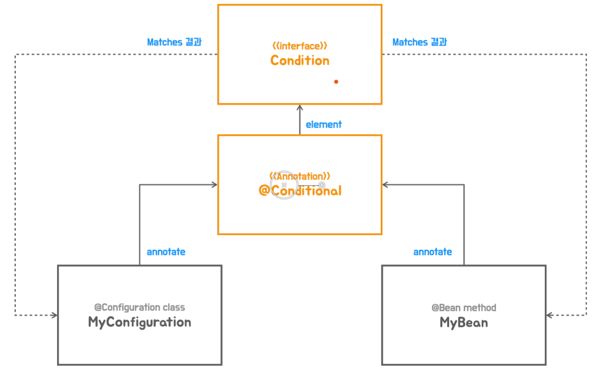

# 07 조건부 자동 구성

◼︎ @Conditinal과 Condition 인터페이스

@Conditional은 스프링 4.0에 추가된 애노테이션으로 모든 조건을 만족하는 경우에만 컨테이너에 빈으로 등록되도록 한다.

```java

@Target({ElementType.TYPE, ElementType.METHOD})
@Retention(RetentionPolicy.RUNTIME)
@Documented
public @interface Conditional {

  Class<? extends Condition>[] value();
}
```

Condition은 @Conditional에 지정되어서 구체적인 매칭 조건을 가진 클래스가 구현해야 할 인터페이스이다.

```java

@FunctionalInterface
public interface Condition {

  boolean matches(ConditionContext context, AnnotatedTypeMetadata metadata);
}
```

@Conditional은 @Configuration 클래스와 @Bean 메서드에 적용 가능하다.   
클래스 조건을 만족하지 못하면 @Bean 메서드는 무시된다.



◼︎ @Conditional 테스트 코드 작성

```java
public class ConditionalTest {

  @Test
  void conditionalIsTrue() {
    ApplicationContextRunner contextRunner = new ApplicationContextRunner();
    contextRunner.withUserConfiguration(Config1.class)
        .run(context -> {
          assertThat(context).hasSingleBean(Config1.class);
          assertThat(context).hasSingleBean(MyBean.class);
        });
  }

  @Test
  void conditionalIsFalse() {
    ApplicationContextRunner contextRunner = new ApplicationContextRunner();
    contextRunner.withUserConfiguration(Config2.class)
        .run(context -> {
          assertThat(context).doesNotHaveBean(Config2.class);
          assertThat(context).doesNotHaveBean(MyBean.class);
        });
  }

  @Configuration
  @BooleanConditional(true)
  static class Config1 {

    @Bean
    MyBean myBean() {
      return new MyBean();
    }
  }

  @Configuration
  @BooleanConditional(false)
  static class Config2 {

    @Bean
    MyBean myBean() {
      return new MyBean();
    }
  }

  static class MyBean {

  }

  @Retention(RetentionPolicy.RUNTIME)
  @Target(ElementType.TYPE)
  @Conditional(BooleanCondition.class)
  @interface BooleanConditional {

    boolean value();
  }

  static class BooleanCondition implements Condition {

    @Override
    public boolean matches(ConditionContext context, AnnotatedTypeMetadata metadata) {
      Map<String, Object> annotationAttributes = metadata.getAnnotationAttributes(
          BooleanConditional.class.getName());

      return (Boolean) annotationAttributes.get("value");
    }
  }
}
```

◼︎ 커스텀 @Conditional

- 클래스 기준 조건부 구성
  스프링 부트가 사용하는 @Conditional의 가장 대표적인 방법은 클래스의 존재를 확인하는 것이다.   
  어떤 기술의 클래스를 사용하도록 dependency를 추가 했다면 이 기술을 사용할 의도가 있다는 것으로 보고 자동 구성 클래스를 등록시켜준다.

```java
public class MyConditionOnClass implements Condition {

  @Override
  public boolean matches(ConditionContext context, AnnotatedTypeMetadata metadata) {
    Map<String, Object> attributes = metadata.getAnnotationAttributes(
        ConditionalMyOnClass.class.getName());

    String value = (String) attributes.get("value");
    return ClassUtils.isPresent(value,
        context.getClassLoader());   // Class Loader에 의해 등록된 클래스 존재 유무 확인
  }
}

```

◼︎ 커스텀 @Conditional 동작 방식


◼︎ 자동구성 정보 대체하기
자동 구성 정보는 다음의 과정으로 구성정보가 등록된다.

1. imports 파일에서 자동 구성 정보 클래스 후보가 로딩된다.
2. @Conditional 조건 체크를 통해서 선택된 클래스가 빈으로 등록된다.

개발자가 자동 구성으로 등록되는 빈과 동일한 타입의 빈을 @Configuration, @Bean 을 이용해서 직접 정의하는 경우   
이 빈 구성이 자동 구성을 대체할 수 있다.

자동구성 클래스의 @Bean 메서드에 @ConditionalOnMissingBean이 있는 경우엔 유저 구성에 지정된 타입의 빈이 정의 되어 있으면   
자동 구성 빈의 조건이 충족되지 않아 등록되지 않는다.

```java
/**
 * 유저 구성 빈이 등록되었기 때문에 자동구성 빈은 등록되지 않는다.
 */
@MyAutoConfiguration
@ConditionalMyOnClass("org.apache.catalina.startup.Tomcat")
public class TomcatWebServerConfig {

  @Bean("tomcatWebServerFactory")
  @ConditionalOnMissingBean
  public ServletWebServerFactory servletWebServerFactory() {
    return new TomcatServletWebServerFactory();
  }
}
```

```java
/**
 * 유저 등록 빈이 우선된다.
 */
@Configuration(proxyBeanMethods = false)
public class WebServerConfiguration {

  @Bean
  public ServletWebServerFactory customWebServerFactory() {
    TomcatServletWebServerFactory serverFactory = new TomcatServletWebServerFactory();
    serverFactory.setPort(9090);
    return serverFactory;
  }
}
```

◼︎ 사용자구성정보 vs 자동구성정보 빈 등록 우선순위


◼︎ 스프링 부트의 @Conditional

- @Profile 도 @Confitional Meta-annotation을 포함하는 애노테이션이다.

```java

@Target({ElementType.TYPE, ElementType.METHOD})
@Retention(RetentionPolicy.RUNTIME)
@Documented
@Conditional(ProfileCondition.class)
public @interface Profile {

  String[] value();
}
```

- Class Conditions

1. @ConditionalOnClass
2. @ConditionalOnMissingClass

지정한 클래스의 프로젝트 내 존재를 확인해서 포함 여부를 결정한다.   
주로 @Configuration 클래스 레벨에서 사용하지만 @Bean 메서드에도 적용 가능하다.   
단, 클래스 레벨의 검증 없이 @Bean 메서드에만 적용하면 불필요하게 @Configuration 클래스가 빈으로 등록되기 때문에 클래스 레벨 사용을 우선해야 한다.

- Bean Conditions

1. @ConditionalOnBean
2. @ConditionalOnMissingBean

빈의 존재 여부를 기준으로 포함여부를 결정한다. 빈의 타입 또는 이름을 지정할 수 있다. 지정된 빈 정보가 없으면 메서드의 리턴 타입을 기준으로 빈의 존재 여부를 체크한다.   
컨테이너에 등록된 빈 정보를 기준으로 체크하기 때문에 자동 구성 사이에 적용하려면 @Configuration 클래스의 적용 순서가 중요하다.   
개발자가 직접 정의한 커스텀 빈 구성 정보가 자동 구성정보 처리보다 우선하기 때문에 이 관계에 적용하는 것은 안전하다.   
반대로 커스텀 빈 구성 정보에 적용하는 건 피해야 한다.

> @Configuration 클래스 레벨의 @ConditionalOnClass와 @Bean 메서드 레벨의 @ConditionalOnMissingBean 조합은 가장 대표적으로
> 사용되는 방식이다.
> 클래스의 존재로 해당 기술 여부를 파악하고, 직접 추가한 커스텀 빈 구성의 존재를 확인해서 자동 구성의 빈 오브젝트를 이용할지 최종 결정한다.

- Property Conditions
  @ConditionalOnProperty는 스프링의 환경 프로퍼티 정보를 이용한다. 지정된 프로퍼티가 존재하고 값이 false가 아니면 포함 대상이 된다.   
  특정 값을 가진 경우를 확인하거나 프로퍼티가 존재하지 않을 때 조건을 만족하게 할 수도 있다.   
  프로퍼티의 존재를 확인해서 빈 오브젝트를 추가하고, 해당 빈 오브젝트에서 프로퍼티 값을 이용해서 세밀하게 빈 구성을 할 수도 있다.

- Resource Conditions
  @ConditionalOnrEsource는 지정된 리소스(파일)의 존재를 확인하는 조건

- Web Application Conditions

1. @ConditionalOnWebApplication
2. @ConditionalOnNotWebApplication

웹 어플리케이션 여부를 확인한다.

- SpEL Expression Conditions
  @ConditionalOnExpression은 스프링 SpEL(스프링 표현식)의 처리 결과를 기준으로 판단. 매우 상세한 조건 설정이 가능하다.
