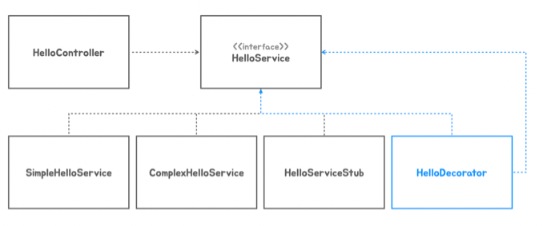
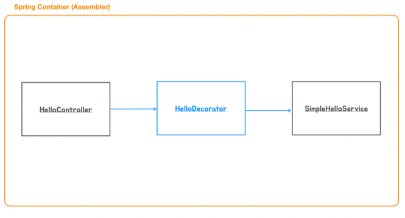
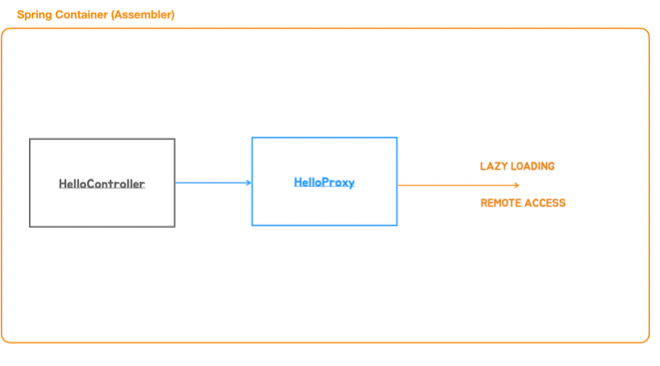
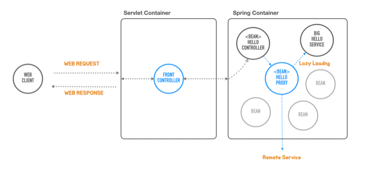

# 05 DI와 테스트, 애노테이션 활용

### 테스트 코드를 이용한 테스트

◼︎ TestRestTemplate
웹서버에 HTTP 요청을 보내고 응답을 받아서 검증하는 테스트에서는 TestRestTemplate을 사용

◼︎ DI와 단위테스트

DI는 컨테이너 없이도 자바코드로 활용이 가능하다. 테스트 코드를 작성할 때 이용하면 의존관계 주입을 이용해서 고립된 테스트를 작성할 수 있다.

```java
/**
 * HTTP 인수테스트
 * - TestRestTemplate 사용
 */
public class HelloApiTest {

  @Test
  void helloApi() {
    TestRestTemplate rest = new TestRestTemplate();
    ResponseEntity<String> res = rest.getForEntity("http://localhost:8080/hello?name={name}",
        String.class, "Spring");

    assertThat(res.getStatusCode()).isEqualTo(HttpStatus.OK);
    assertThat(res.getHeaders().getFirst(HttpHeaders.CONTENT_TYPE)).startsWith(
        MediaType.TEXT_PLAIN_VALUE);
    assertThat(res.getBody()).isEqualTo("Hello Spring");
  }

  @Test
  void failsHelloApi() {
    TestRestTemplate rest = new TestRestTemplate();

    ResponseEntity<String> res =
        rest.getForEntity("http://localhost:8080/hello?name=", String.class);

    assertThat(res.getStatusCode()).isEqualTo(HttpStatus.INTERNAL_SERVER_ERROR);
  }
}
```

```java
/**
 * Controller 단위 테스트
 * 의존관계가 복잡해지면 MockMvc를 사용해서 스프링 통합 테스트 진행 필요
 */
public class HelloControllerTest {

  @Test
  void helloController() {
    //given
    HelloController helloController = new HelloController(name -> name);
    //when
    String res = helloController.hello("Test");

    //then
    Assertions.assertThat(res).isEqualTo("Test");
  }

  @Test
  void failedHelloController() {
    //given
    HelloController helloController = new HelloController(name -> name);

    //when, then
    Assertions.assertThatThrownBy(
        () -> helloController.hello(null)
    ).isInstanceOf(IllegalArgumentException.class);

    Assertions.assertThatThrownBy(
        () -> helloController.hello("")
    ).isInstanceOf(IllegalArgumentException.class);
  }
}
```

```java
/**
 * Service 단위 테스트
 * 의존관계 복잡해지면 스프링 통합 테스트 필요
 */
public class HelloServiceTest {

  @Test
  void simpleHelloService() {
    //given
    HelloService helloService = new SimpleHelloService();

    //when
    String res = helloService.sayHello("Spring");

    //then
    assertThat(res).isEqualTo("Hello Spring");
  }
}
```

◼︎ DI를 이용한 Decorator 패턴과 Proxy패턴

- Decorator Pattern
  기존 코드에 동적으로 책임을 추가할 때 쓰는 패턴





데코레이터는 자기가 구현하는 인터페이스 타입의 다른 오브젝트를 의존한다.

- @Primary
  여러 개의 DI 후보 오브젝트가 있을 때 우선순위를 부여해서 단일 의존 오브젝트로 취급

```java

@Service
@Primary
public class HelloDecorator implements HelloService {

  private final SimpleHelloService helloService;

  public HelloDecorator(SimpleHelloService helloService) {
    this.helloService = helloService;
  }

  @Override
  public String sayHello(String name) {
    return "*" + helloService.sayHello(name) + "*";
  }
}
```

◼︎ Proxy Pattern
프록시 패턴에서 프록시는 다른 오브젝트의 대리자 혹은 플레이스 홀더 역할을 한다.





프록시 패턴의 프록시와 일반적인 용어 프록시, 자바의 다이나믹 프록시가 동일한 건 아니다.
